## Introduction

Meridian's workforce needs SaaS applications, and how those apps trust Meridian's identity provider is a security decision, not an IT convenience. This sprint stands up the three federation and provisioning patterns every IAM engineer is expected to know: SAML single sign-on, OpenID Connect with OAuth 2.0, and SCIM automated provisioning.

Each answers a different question. SAML: how does a legacy SaaS trust our sign-ins? OIDC: how do modern apps authenticate our users with tokens? SCIM: how do accounts get created and deprovisioned automatically as people join and leave? Getting these right is what prevents orphaned accounts, token interception, and over-permissioned apps, all common audit findings in a regulated firm.

## Business Scenario

Meridian is onboarding three applications: a legacy vendor portal that speaks SAML, a modern internal web app that authenticates with OIDC, and a third app that needs automated user lifecycle so accounts appear on join and disable on departure without a human in the loop. Each integration is a trust relationship configured deliberately, because a misconfigured federation is a standing security hole.

## Objectives

1. Integrate a SAML application and configure SSO end to end.
2. Register an OIDC / OAuth 2.0 application with least-privilege permissions.
3. Configure SCIM provisioning and validate the connection boundary.
4. Apply enterprise controls: group-based assignment, least-privilege claims and scopes, secure credential choices.
5. Frame each pattern against the threat it mitigates.

## Technologies Used

Microsoft Entra ID P1 (included in the active P2 trial), Enterprise applications, App registrations, SAML 2.0, OpenID Connect, OAuth 2.0, SCIM 2.0, Microsoft Entra SAML Toolkit.

## Licensing Note

Sprint 5 runs entirely on P1, which the P2 trial includes. None of it consumes the P2-specific trial clock, so this sprint can be done at any time, even after the trial converts down. The metered standalone SCIM Provisioning API (a billed add-on) was deliberately avoided; this lab uses classic P1-covered provisioning configuration.

---

## Part A: SAML Single Sign-On

### The pattern

Plain version: the app hands off login to Entra. Entra authenticates the user and sends the app a signed XML assertion stating who they are. The app trusts the signature and grants access. Entra is the identity provider (IdP); the app is the service provider (SP); the trust is anchored by a signing certificate.

The test app is the Microsoft Entra SAML Toolkit, Microsoft's own gallery-integrated diagnostic app built to complete a full SAML round trip without a real vendor.

### Group-based assignment first

App access is assigned by group, not by individual user, so membership changes flow automatically. A dedicated assignment group was created rather than reusing a department group, because app access is a deliberate grant that should be governable on its own in Sprint 6, not a side effect of a department attribute.

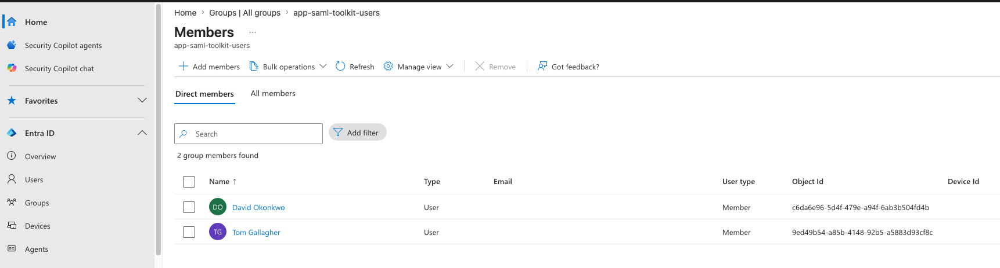

The SAML Toolkit was added from the gallery.

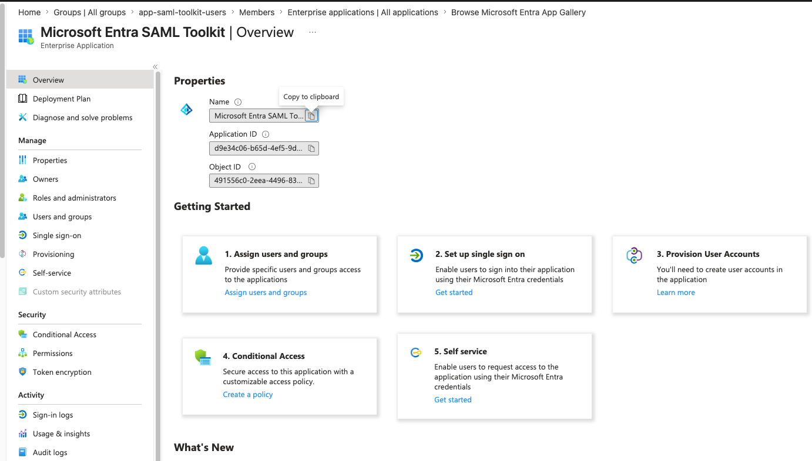

The assignment group was attached to the app. Assigning the group (rather than the two users individually) is the P1 enterprise pattern: add or remove someone from the group and their app access follows automatically.

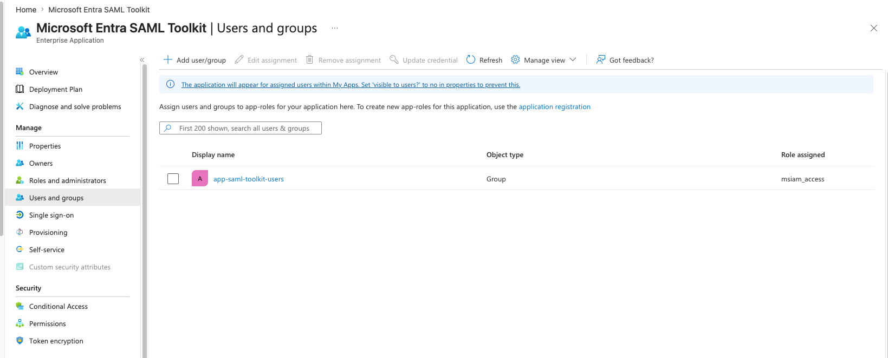

### SAML configuration

The Basic SAML Configuration (Identifier, Reply URL, Sign on URL) was set. A useful gallery-app detail surfaced here: the Identifier and Reply URL came pre-populated because the SAML Toolkit is a gallery app that ships with these defaults. A custom non-gallery app would require all three to be entered from scratch.

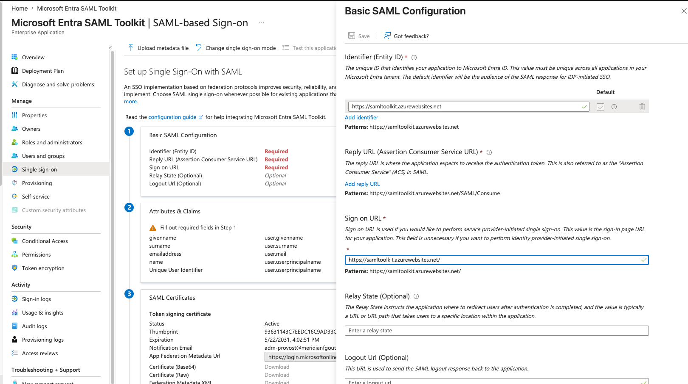

### Least-privilege claims

Every claim in a SAML assertion is user data handed to the service provider. The default claim set was reviewed and trimmed: givenname and surname were removed, keeping only the required Name ID (for sign-in) plus emailaddress and name (commonly used by apps for display and account matching).

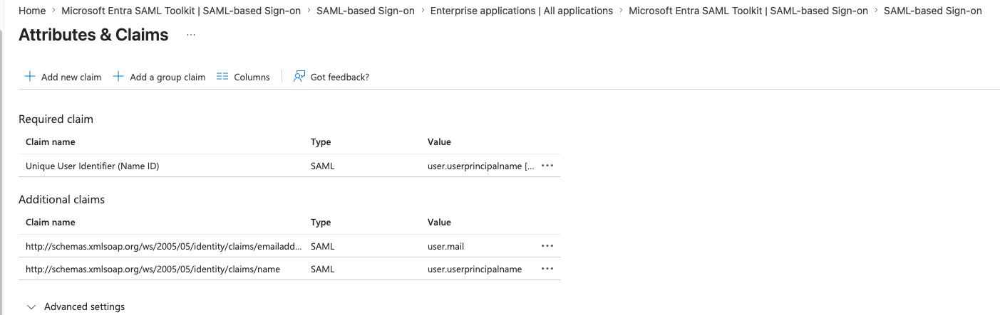

**Attacker and defender framing:** over-broad claims leak more personal data than the app needs, expanding both the privacy exposure and the blast radius if the app is breached. Trimming to the minimum required is the SAML equivalent of least-privilege scoping. This was evaluated trimming, each claim assessed, not blind deletion.

### Successful federated sign-in

Signing in as an assigned user (David Okonkwo) through the My Apps portal launched the toolkit. The toolkit greeted the user by their exact Entra UPN, confirming the full SAML round trip: Entra authenticated the user, signed the assertion, the toolkit validated the signature and consumed it, and identity was federated across.

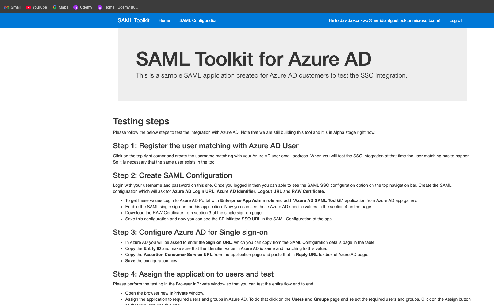

The service-provider side of the trust is visible on the toolkit's own SAML Configuration page, showing the matching Entity ID.

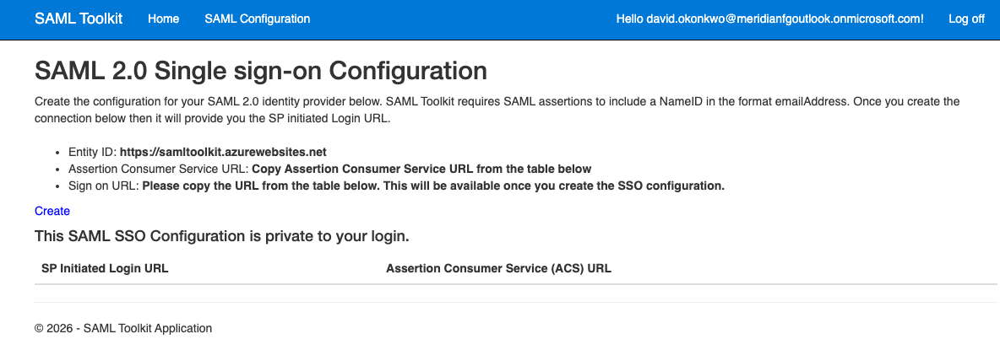

A real-world note captured here: the toolkit expects the NameID in emailAddress format. The lab's Name ID is user.userprincipalname, which worked because the test user's UPN and email align on the .onmicrosoft.com domain. When an app demands emailAddress format and the IdP sends UPN, and they do not match, sign-in fails. NameID format mismatch is a common SAML troubleshooting issue.

---

## Part B: OpenID Connect / OAuth 2.0

### The pattern

OAuth 2.0 handles authorization (what an app may do); OIDC layers authentication on top (who the user is) via an ID token. OIDC lives under App registrations, not the SAML pane. The security-critical setting is the redirect URI, where tokens are delivered after authentication.

### Single-tenant registration

The app was registered as single-tenant ("My organization only"), because Meridian is one organization and only Meridian identities should use an internal app. Leaving an app multi-tenant unnecessarily is a common over-exposure. A web redirect URI was set exactly, no wildcards.

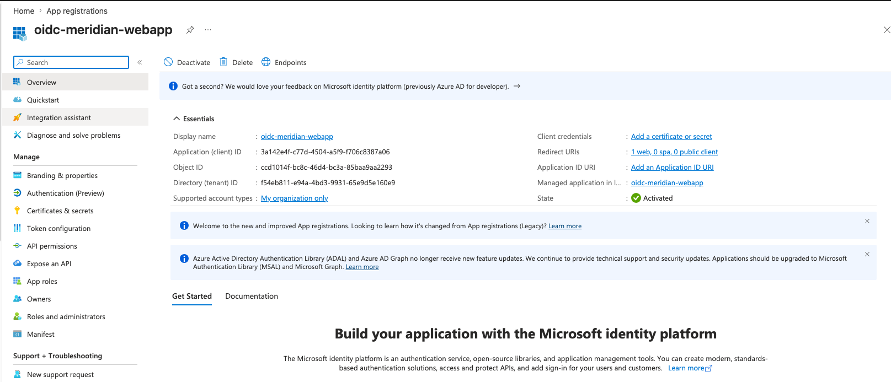

**Why the redirect URI matters:** it is the single most security-critical OIDC setting. A loose or wildcard redirect URI lets an attacker intercept tokens by redirecting them to a URL they control. Exact, HTTPS-only URIs close that gap.

### Least-privilege permissions

The registration was left at its minimal default: Microsoft Graph User.Read, delegated, which permits sign-in and reading the signed-in user's own profile and nothing more. No additional permissions were added.

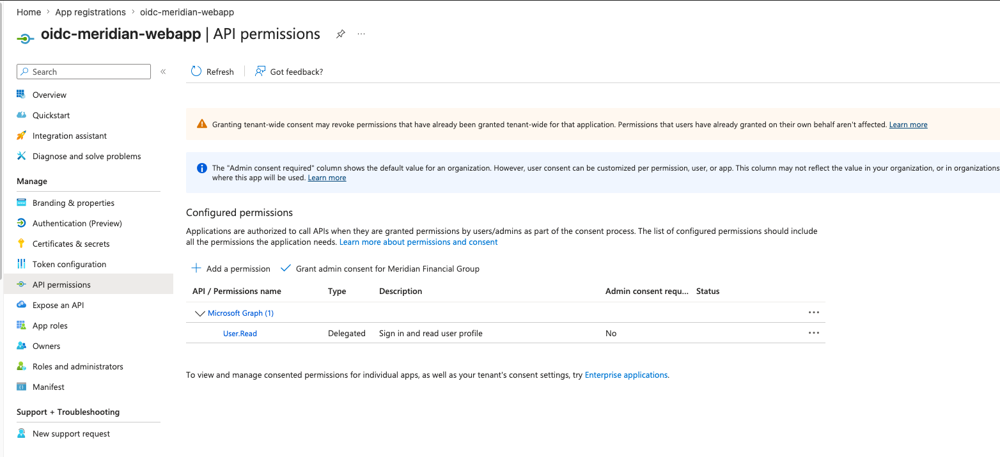

**Delegated vs application permissions (a key distinction):** delegated permissions act as the signed-in user, bounded by that user's own rights. Application permissions act as the app itself, with no user context, often tenant-wide, and are far higher risk because a stolen app credential grants that access with no user involved. Keeping this app at User.Read delegated demonstrates the least-privilege discipline. The "Grant admin consent" control is the defense against consent phishing: admin consent lets an administrator centrally approve permissions rather than leaving it to individual users.

### Credential decision: no client secret

No client secret was created. In production this app would authenticate using a certificate or workload identity federation rather than a client secret. A client secret is a shared password string that can leak, be committed to source control, or be stolen from configuration. A certificate keeps the private key with the app; a federated credential eliminates the stored secret entirely. Client secrets are the weakest of the three options.

**Attacker and defender framing:** stolen client secrets on app registrations are a common cloud breach vector, an attacker with the secret authenticates as the app with no user required. Choosing a certificate or federated credential removes or shrinks that attack surface. Demonstrating the knowledge and making the defensible choice is stronger than creating a secret the lab app does not need.

---

## Part C: SCIM Automated Provisioning

### The pattern

SCIM standardizes automated user lifecycle. Assign a user to the app in Entra, and Entra calls the app's SCIM endpoint to create the account. Change attributes, Entra updates them. Unassign the user or they leave, Entra sets the account inactive. No human in the loop.

### Approach and honest scope

A live SCIM target was out of scope for a no-cost lab: most real SaaS vendors gate their SCIM endpoint behind their own paid enterprise tier, and standing up a self-hosted endpoint requires an Azure App Service with possible cost and an unsupported .NET reference sample. This sprint therefore demonstrates the full Entra-side provisioning configuration up to the connection boundary, and documents the downstream steps that require a live endpoint.

A non-gallery enterprise app was created to expose the full provisioning surface.

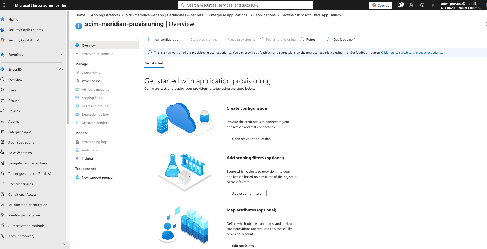

Provisioning Mode was set to Automatic, which reveals the Admin Credentials section, the SCIM connection configuration.

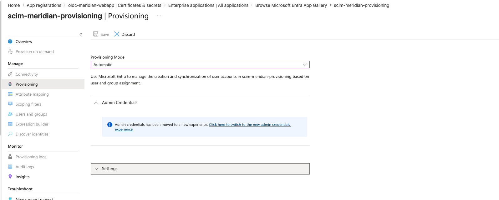

### The connection fields

The Connectivity page holds the SCIM connection: Bearer authentication, the Tenant URL (the target app's SCIM base endpoint), and the Secret Token (the bearer token authenticating Entra to that endpoint). The page states plainly that a successful connection test is required before saving.

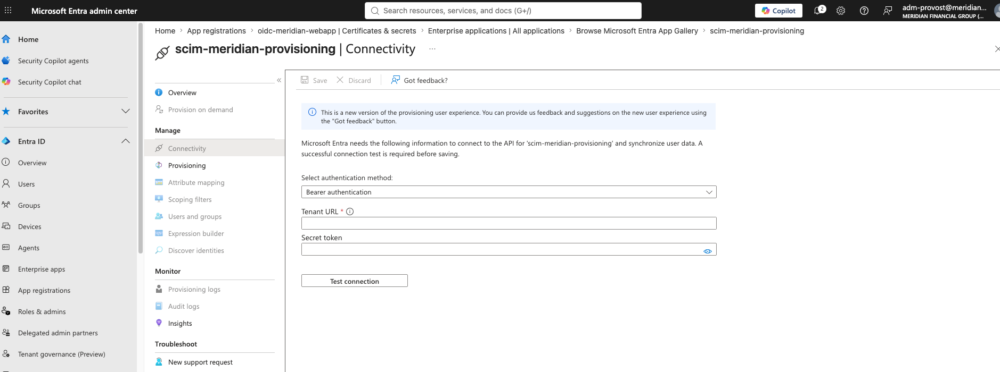

### The connection boundary, demonstrated honestly

Test Connection was run against a deliberately fake, non-resolving placeholder endpoint (a reserved .invalid domain and an obvious placeholder token, so no directory data went anywhere real and no genuine credential was exposed). It failed as expected with CredentialValidationUnavailable.

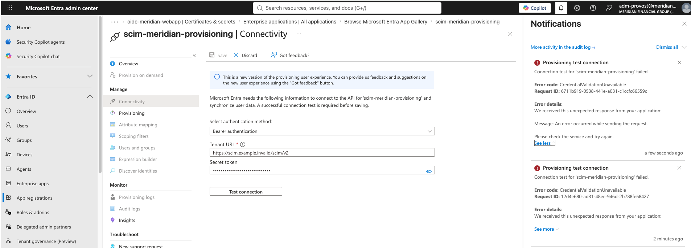

This failure is the point: it confirms Entra actively attempts to reach and authenticate to the SCIM server, and it explains why the Attribute Mapping and Scoping Filters blades remain locked. Those unlock only after a real endpoint validates. In production, these fields hold the target app's live SCIM URL and bearer token, and a successful test unlocks the full configuration.

### Scoping and the deprovisioning attribute (documented as concepts)

Two configuration pieces unlock only after a live connection, so they are documented here as the knowledge they represent:

**Scoping** is the blast-radius control. The setting has two choices: sync only assigned users and groups (safe, correct) or sync all users and groups (dangerous). Always scope to assigned-users-only so provisioning follows deliberate assignment, never the whole directory. A "sync all" misconfiguration is a real incident, an entire directory pushed into a SaaS app.

**The `active` attribute** is what makes SCIM a security control rather than a convenience. When a user is unassigned or offboarded, Entra sets active=false, disabling their account in the target automatically. Without SCIM, a leaver's SaaS account lingers as a standing credential nobody remembers to disable, a classic audit finding and a genuine breach vector.

---

## Validation

| Check | Result | Where confirmed |
|---|---|---|
| SAML app added, group-assigned | Pass | Enterprise apps > SAML Toolkit > Users and groups |
| SAML SSO configured | Pass | Single sign-on, all three URLs set |
| Claims trimmed to least privilege | Pass | Attributes and claims (givenname, surname removed) |
| SAML SSO succeeds, identity federated | Pass | Toolkit greets user by UPN |
| OIDC app registered, single-tenant, exact redirect | Pass | App registration overview |
| OIDC permissions least-privilege | Pass | API permissions, User.Read only |
| OIDC credential model chosen deliberately | Pass | No secret; certificate/federated documented |
| SCIM provisioning mode Automatic | Pass | Provisioning blade |
| SCIM connection fields understood | Pass | Connectivity page |
| SCIM connection boundary confirmed | Pass | Test Connection failure against placeholder |

## Lessons Learned

- Gallery apps ship with SAML defaults (Identifier, Reply URL pre-filled); custom apps require all values entered manually.
- NameID format matters. The toolkit expects emailAddress format; UPN worked only because UPN and email aligned on the tenant domain. A mismatch would fail sign-in.
- The strongest security stance is sometimes to not create something. Skipping the OIDC client secret in favor of a certificate or federated credential is a more senior choice than clicking create.
- SCIM's downstream config (mappings, scoping) is gated behind a validated live connection, which a no-cost lab cannot fully provide. Documenting the boundary honestly, with the expected Test Connection failure as evidence, is a legitimate demonstration of the skill.

## Enterprise Best Practices

- Assign apps by group, never by individual user, so lifecycle changes propagate automatically.
- Trim SAML claims and OIDC scopes to least privilege; apps receive only what they need.
- Register exact, HTTPS-only redirect URIs; wildcards enable token interception.
- Prefer certificates or federated credentials over client secrets.
- Control admin consent to defend against consent phishing.
- Scope SCIM provisioning to assigned users only; never sync the whole directory.
- Protect the SCIM bearer token like any credential; it can create and disable accounts.
- Cross-reference Sprint 3: apply Conditional Access to these apps by persona.

## Conclusion

Sprint 5 establishes federation and provisioning on real integrations, demonstrating SAML (with a live federated sign-in), OIDC (least-privilege, secure credential choice), and SCIM (configured to the connection boundary, with mappings and scoping documented). These apps become the targets that Sprint 6's entitlement management will govern with access packages, so this sprint feeds directly into identity governance.
