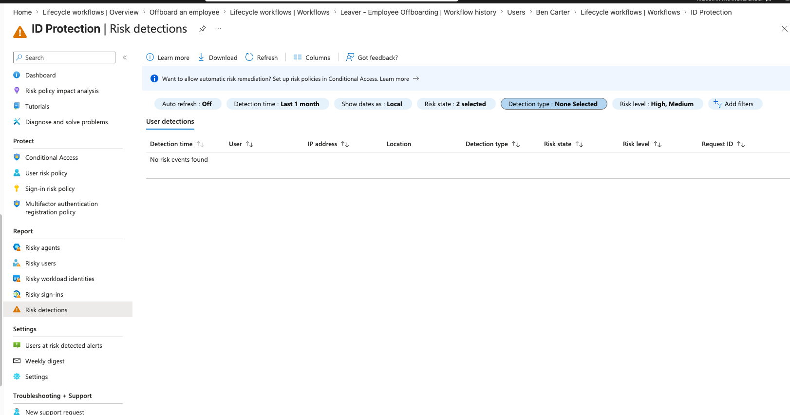
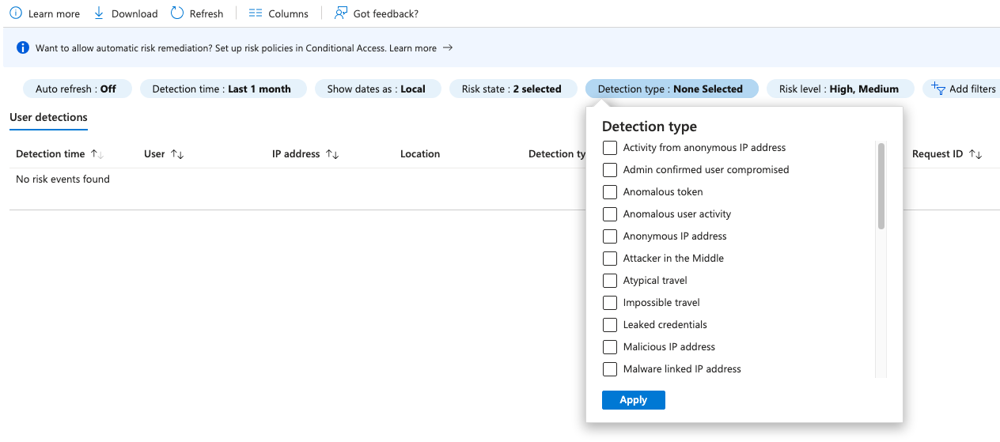
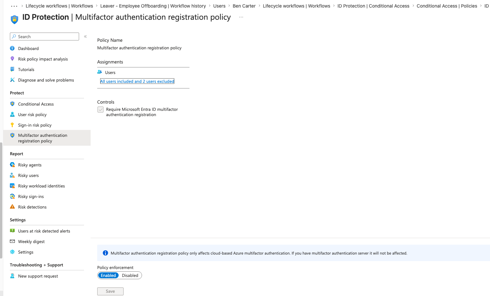
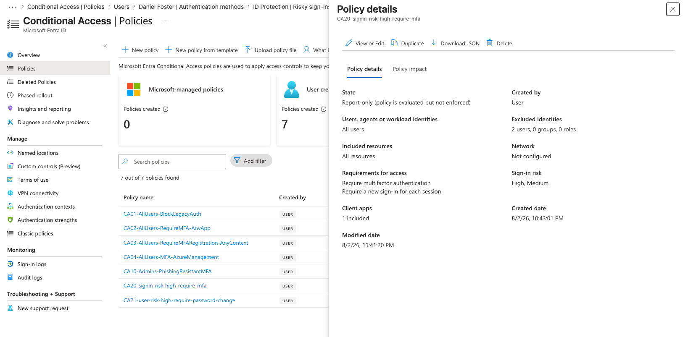
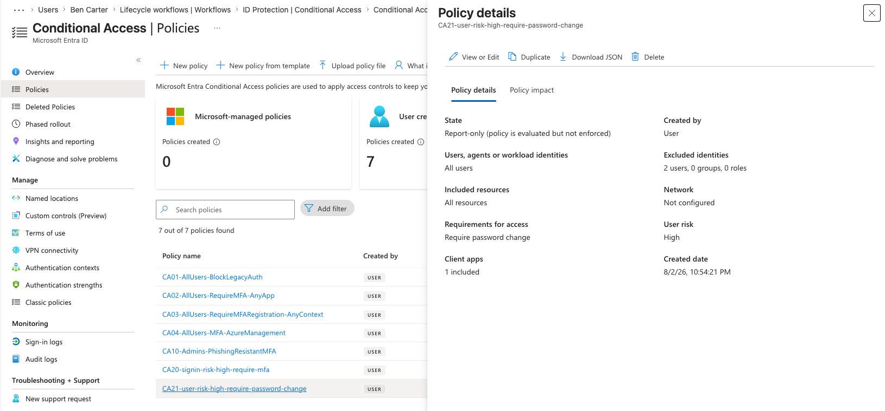
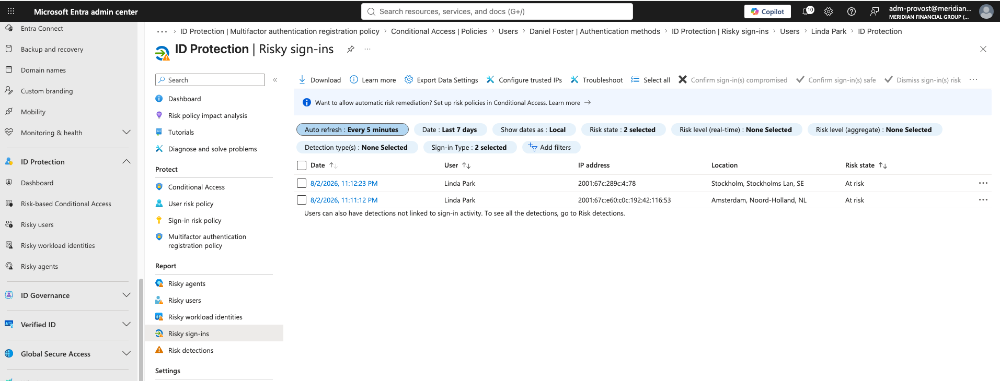
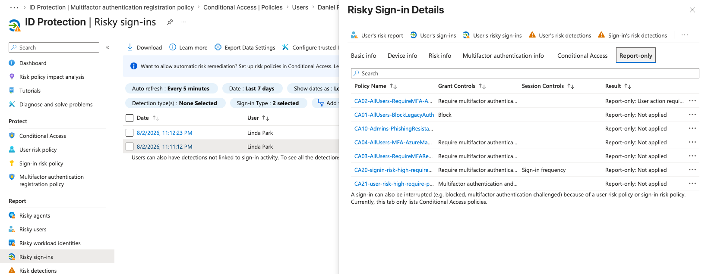
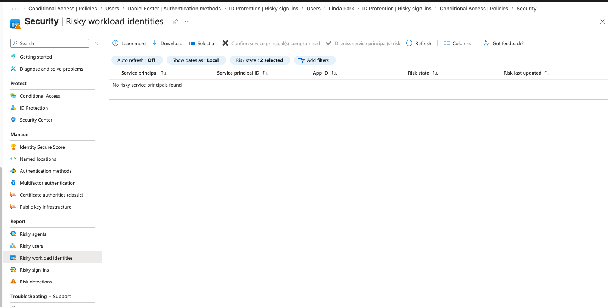
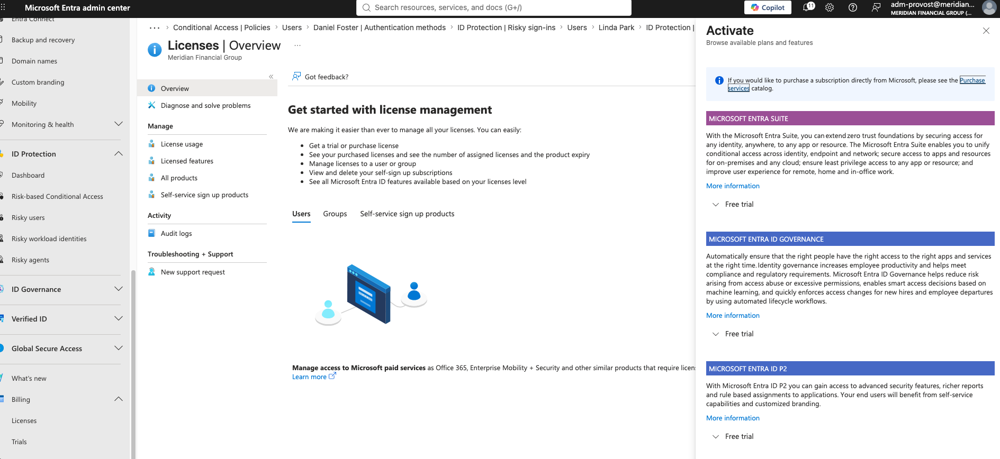

## Introduction

Identity Protection is the risk engine of Microsoft Entra ID. It uses machine learning trained on Microsoft's signal at scale to score whether a sign-in or an account is compromised, then hands that score to Conditional Access to enforce a response. This sprint wires that engine into Meridian Financial Group's access control plane and proves it end to end with a live risk detection.

The work follows the current supported design. Microsoft retires the legacy risk enforcement policies that used to live inside Identity Protection on October 1, 2026. Risk enforcement now belongs in Conditional Access. This sprint builds it that way from the start, so nothing here sits on a deprecation path.

## Business Scenario

Meridian is a regulated financial firm. A compromised advisor account or a leaked service principal secret is the exact failure mode that leads to a reportable breach under GLBA and a SOX controls finding. The board expects automated containment, not a human watching a dashboard.

Three business drivers shape this sprint:

- **Automated containment.** When an account is flagged high risk, the response must be immediate and consistent, not dependent on an analyst being awake.
- **Self-service remediation.** A legitimate user caught by a false positive should clear themselves through MFA or a password change, without a helpdesk ticket, so the control does not become a productivity tax.
- **Non-human identity coverage.** Service principals cannot do MFA and often have no lifecycle owner. In a financial firm running automated trading and reporting jobs, an over-permissioned or leaked service principal is a top-tier risk that traditional user controls never touch.

## Objectives

- Understand the Identity Protection detection catalog for users and workload identities
- Enable the MFA registration policy so every user has a second factor available before risk enforcement depends on it
- Build risk-based Conditional Access policies in report-only, the current supported way
- Trigger a real risk detection and prove the policy evaluation in report-only
- Tune the policy based on the observed detection rather than assumption
- Extend risk coverage to workload identities and document the licensing boundary honestly
- Map every detection to an attacker technique and a defender control

## Certification Objectives Covered

| Exam | Domain | What this sprint proves |
|------|--------|-------------------------|
| SC-300 | Implement and manage Identity Protection | Configure and operationalize risk policies, investigate risky users and sign-ins |
| SC-300 | Plan and implement Conditional Access | Risk-based conditions, report-only rollout, threshold tuning |
| AZ-500 | Manage identity and access | Identity Protection risk remediation, workload identity risk |
| SC-200 | Mitigate threats using Microsoft Entra ID Protection | Investigate and remediate identity risk detections |

## Technologies Used

Microsoft Entra ID Protection, Conditional Access, Microsoft Graph PowerShell SDK, service principal (single-tenant enterprise app), Tor Browser (for controlled risk generation).

## Licensing

| Feature | License required | Meridian status |
|---------|-----------------|-----------------|
| User risk and sign-in risk detections | Entra ID P2 | Covered by P2 trial |
| Risk-based Conditional Access (users) | Entra ID P2 | Covered |
| MFA registration policy | Entra ID P2 | Covered |
| Workload identity risk detections | P2 gets detections with limited detail | Covered with reduced reporting |
| Conditional Access scoped to service principals | Workload Identities Premium (separate SKU, ~$3/workload/month) | Not licensed, trial not self-service, documented as a boundary |

> **Important:** Creating a Conditional Access policy scoped to a service principal requires Workload Identities Premium, a standalone SKU that P2 does not include. On P2 alone, workload identity detections still appear but with limited reporting detail, and a service-principal-scoped CA policy cannot be created. This sprint demonstrates the feature to the boundary and documents the limit rather than buying the add-on, consistent with the project's honest-documentation convention.

> **Note:** Managed identities are out of scope for Identity Protection risk. Workload identity risk applies only to single-tenant service principals registered in the tenant.

## Architecture

The design separates detection from enforcement, which is the whole point of the current model.

```
                    IDENTITY PROTECTION (detection)
   +--------------------------------------------------------------+
   |  Sign-in risk signals        User risk signals                |
   |  - anonymous IP / Tor        - leaked credentials             |
   |  - atypical travel           - Entra threat intelligence      |
   |  - unfamiliar sign-in props  - aggregated account risk        |
   |                                                               |
   |  Workload identity signals                                    |
   |  - leaked credentials  - suspicious sign-ins  - anomalous SP  |
   +----------------------------+---------------------------------+
                                | risk level (Low/Medium/High)
                                v
                    CONDITIONAL ACCESS (enforcement)
   +--------------------------------------------------------------+
   |  CA20  Sign-in risk Medium+High -> require MFA + reauth       |
   |  CA21  User risk High            -> require password change    |
   |  CA22  Service principal risk    -> BLOCKED by licensing       |
   |                                                               |
   |  User policies exclude bg-emergency-01 / bg-emergency-02 only |
   +--------------------------------------------------------------+
```

### Architecture Decision AD-008: Risk enforcement in Conditional Access, not legacy ID Protection policies

**Decision.** Build all risk enforcement as Conditional Access policies. Do not create or enable the legacy User Risk and Sign-in Risk policies inside Identity Protection.

**Rationale.** Microsoft retires those legacy policies on October 1, 2026. Conditional Access is the go-forward enforcement plane and adds capabilities the legacy policies never had: report-only mode, sign-in log visibility into which policy applied, and combination with other conditions like sign-in frequency. Building the deprecated way would mean documenting a control that stops working shortly after this sprint.

**Consequence.** Risk enforcement lives alongside every other CA policy in the `/conditional-access/` topic folder, under the same report-only-first convention. The MFA registration policy stays in Identity Protection because it is not a risk-enforcement policy and is not being retired.

### Architecture Decision AD-009: adm-provost included in risk policies

**Decision.** Exclude only the two break-glass accounts from the risk-based CA policies. Do not exclude the daily admin account `adm-provost`.

**Rationale.** Break-glass accounts exist precisely so daily admins do not need standing exclusions. An excluded admin is a standing gap, and admin accounts are the highest-value target in the tenant. If `adm-provost` is compromised, sign-in risk detection is the control that catches the anomalous login. Excluding it would disable that control for the one account that matters most. The break-glass design, validated under pressure in Sprint 4, is the lockout insurance that makes this safe.

**Consequence.** `adm-provost` is subject to CA20 and CA21 like any other user. The initial CA20 build carried a three-account exclusion by mistake; it was corrected to two (break-glass only) before the sprint proceeded.

### Architecture Decision AD-010: Workload identity enforcement deferred on licensing

**Decision.** Demonstrate workload identity risk detection on P2, but do not build the service-principal-scoped CA policy (CA22). Document it as a licensing boundary.

**Rationale.** A CA policy scoped to a service principal requires Workload Identities Premium, a separate SKU. The 90-day trial for that SKU was not available as a self-service activation in this tenant (the Licenses activation blade offered only Entra Suite, ID Governance, and P2). Rather than fake the enforcement, the sprint documents the exact boundary: what P2 covers, what the add-on unlocks, and what it costs.

**Consequence.** CA22 is described in the architecture and validated to the point the license blocks. This matches the Sprint 5 SCIM pattern, where a feature was demonstrated to a hard boundary and the limit documented honestly.

## Step-by-Step Implementation

The sprint ran in six blocks. Portal first to build understanding, then the Graph equivalent for the user-facing policies.

### Block 1: Tour the detection catalog

Before configuring anything, understand what the engine detects. You cannot tune or defend a signal you do not understand.

Navigate to **Entra ID > Protection > Identity Protection > Dashboard**. The left navigation exposes Risky users, Risky sign-ins, Risky workload identities, and Risk detections.

Open **Risk detections** and expand the Detection type filter to see the catalog.


*Identity Protection Risk detections. Clean tenant, no risk events yet. The blue banner confirms Microsoft's own guidance to set up risk remediation in Conditional Access, the exact model this sprint follows.*


*The detection type filter. Anonymous IP address, Atypical travel, Impossible travel, Leaked credentials, Attacker in the Middle, and Malicious/Malware IP are the signals that matter for this sprint.*

**Detections worth naming in an interview:**

| Detection | Type | What it means |
|-----------|------|---------------|
| Anonymous IP address | Sign-in | Sign-in from Tor or an anonymizing proxy |
| Atypical / Impossible travel | Sign-in | Two sign-ins from distant locations too close in time to be real travel |
| Unfamiliar sign-in properties | Sign-in | Pattern deviates from the user's learned baseline |
| Leaked credentials | User | The user's valid credentials appeared in a known dump or paste site |
| Entra threat intelligence | User or sign-in | Activity matches a known attack pattern from Microsoft threat intel |

### Block 2: Enable the MFA registration policy

This is the one policy that legitimately stays in Identity Protection. It does not enforce risk. It ensures users are registered for MFA so that when a risk policy later requires MFA, the user can actually perform it.

Navigate to **Identity Protection > Multifactor authentication registration policy**.

1. Set **Assignments > Users** to All users.
2. Exclude the two break-glass accounts.
3. Confirm **Controls** shows Require Microsoft Entra ID multifactor authentication registration.
4. Set **Policy enforcement** to Enabled.
5. Save.


*MFA registration policy. All users included, 2 users (break-glass) excluded, enforcement Enabled. The greyed Save button confirms the state is committed.*

> **Common mistake:** Enabling a sign-in-risk-requires-MFA policy without this in place first. Unregistered users hit the risk policy, cannot complete MFA, and get blocked, generating helpdesk load that looks like the risk policy is broken.

### Block 3: Build CA20, sign-in risk requires MFA, in report-only

First risk enforcement policy. When a sign-in scores risky, require MFA. Report-only first, per the non-negotiable project convention.

Navigate to **Conditional Access > Policies > New policy**.

1. Name: `CA20-signin-risk-high-require-mfa`
2. Assignments > Users: Include All users, Exclude the two break-glass accounts only.
3. Target resources: All resources.
4. Conditions > Sign-in risk: initially High.
5. Grant: Require multifactor authentication.
6. Session: Require a new sign-in for each session (defeats token replay on a risky session).
7. Enable policy: Report-only.

The initial build accidentally carried a three-account exclusion, including `adm-provost`. Per AD-009, this was corrected to break-glass only before proceeding.


*CA20 in report-only. Sign-in risk widened to High and Medium (see Block 5 for why), require MFA plus reauth per session, 2 users excluded.*

> **Warning:** Exclude only break-glass from risk policies. Excluding a daily admin account creates exactly the standing gap an attacker looks for.

### Block 4: Build CA21, user risk requires password change, in report-only

When an account's aggregate risk scores High (leaked credentials, threat intel), force a secure password change to invalidate the compromised credential.

1. Name: `CA21-user-risk-high-require-password-change`
2. Assignments > Users: Include All users, Exclude the two break-glass accounts only.
3. Target resources: All resources.
4. Conditions > User risk: High.
5. Grant: Require password change (MFA-backed by design).
6. Enable policy: Report-only.


*CA21 in report-only. User risk High, require password change, 2 users excluded.*


*CA21 grant control detail: require password change.*

**Sign-in risk versus user risk.** CA20 fires on a single risky sign-in and requires MFA to prove it is you. CA21 fires on a risky account and forces a password change to kill the compromised credential. Different signal, different response.

### Block 5: Trigger a real sign-in risk detection

Documentation is stronger with live evidence. A test user signed in through Tor Browser to generate a genuine Anonymous IP detection.

**Controls observed:** test user only (never admin or break-glass), a controlled machine, a real risk event generated on purpose in the tenant.

The first attempt used a temporary password, which forces a first-login password-change flow rather than a normal interactive sign-in, and produced no detection. After resetting the test user to a known permanent password and completing setup, a clean interactive sign-in through Tor produced results.


*Two at-risk sign-ins for the test user, minutes apart, from Stockholm and Amsterdam. Tor rotated exit nodes across the two sign-ins. The European locations against a US-based user are the anomalous signal.*

Opening the sign-in detail showed the detection and, critically, its risk level.


*The Anonymous IP detection scored Medium (real-time). The report-only tab shows CA20 evaluated but did not apply, because CA20 initially targeted High only. Every other CA policy's evaluation is visible too. This is report-only doing its job: proving policy behavior against a real risky sign-in before enforcement.*

**The tuning decision.** A single Anonymous IP sign-in scores Medium, not High. CA20 initially targeted High, so it did not apply. Rather than leave a real anonymized attack path unchallenged, CA20 was widened to Medium and High. MFA is low-friction, and the live evidence showed the exact attack this control should catch lands at Medium. This is a tuning decision driven by an observed detection, not by a default. CA20's final state (screenshot 99) reflects Medium and High.

### Block 6: Workload identity risk

Service principals are the identities most organizations govern worst, and increasingly the attacker's target because they cannot do MFA and often have no owner.

**Part A, detection.** Navigate to **Identity Protection > Risky workload identities**.


*Risky workload identities. No risky service principals in a clean tenant, which is expected. On P2 without Workload Identities Premium, detections would appear here with limited detail.*

**Workload identity detections to name:**

| Detection | What it means |
|-----------|---------------|
| Leaked credentials | The SP's secret or certificate was found in a public repo or dump |
| Suspicious sign-ins | Sign-in properties unusual for this specific service principal |
| Anomalous service principal activity | Suspicious directory changes deviating from the SP's baseline |
| Suspicious API traffic | Abnormal Graph API traffic or directory enumeration by the SP |

**Part B, enforcement, blocked by licensing.** The plan was CA22, a policy blocking a risky service principal (the SAML Toolkit SP from Sprint 5). Creating a service-principal-scoped CA policy requires Workload Identities Premium. The self-service trial for that SKU was not available in this tenant; the Licenses activation blade offered only Entra Suite, ID Governance, and P2.


*The trial activation blade. Entra Suite, ID Governance, and P2 are offered. Workload ID Premium is not self-service here, confirming the boundary. CA22 is documented rather than built (AD-010).*

## Attacker and Defender Framing

| Attacker technique | How it looks in Identity Protection | Defender control this sprint builds |
|--------------------|-------------------------------------|-------------------------------------|
| Credential stuffing with dumped passwords | Leaked credentials raises user risk | CA21 forces a password change, invalidating the leaked secret |
| Sign-in through Tor to hide origin | Anonymous IP raises sign-in risk (observed at Medium) | CA20 (Medium+High) requires MFA, which the attacker cannot satisfy |
| Token theft replayed from a new location | Atypical travel or unfamiliar properties | CA20 plus reauth-per-session forces reauthentication, breaking replay |
| Leaked service principal secret in a public repo | Workload identity leaked credentials | CA22 would block the SP (requires Workload ID Premium); rotate the secret |
| Service principal used for directory enumeration | Suspicious API traffic | Investigate from Risky workload identities; enforcement needs the Premium SKU |

**Real-world example.** The most common cloud breach path is not a zero-day, it is a valid credential used by the wrong person. Leaked-credential and anonymous-IP detections catch exactly that class, and the CA response contains it without a human in the loop. That is the entire value of risk-based access. This sprint proved it with a live detection: a Tor sign-in that scored Medium and, after tuning, would now be challenged for MFA.

## Validation

| Outcome | How confirmed | Evidence |
|---------|--------------|----------|
| MFA registration policy enabled | Enforcement shows Enabled, break-glass excluded | 98 |
| CA20 in report-only, break-glass only excluded | Policy details show report-only, 2 users excluded | 99 |
| CA20 tuned to Medium+High | Policy details show sign-in risk High, Medium | 99 |
| CA21 in report-only | Policy details show report-only, user risk High | 100, 101 |
| Live sign-in risk detection generated | Risky sign-ins shows Anonymous IP for test user | 102 |
| Detection scored Medium, CA20 evaluated | Sign-in detail shows Medium; report-only shows CA20 not applied at High | 103 |
| Workload identity risk surface reachable | Risky workload identities page loads | 104 |
| Workload ID Premium boundary confirmed | Trial not offered in Licenses activation blade | 105 |

## Cross-Reference to the Azure Zero Trust SOC Lab

This sprint stops at the Entra boundary by design. Detection and enforcement live here. The detection-and-response side lives in the SOC lab, and the two connect cleanly:

- Entra risk detections and sign-in logs are the identity signals that feed Sentinel UEBA. UEBA baselines normal behavior per user and surfaces anomalies that enrich the risk picture.
- New Sentinel work should target the Microsoft Defender portal. Microsoft is consolidating Sentinel there, and the Azure-portal experience is on a retirement path (March 31, 2027).
- The seam between the labs: Entra ID diagnostic settings stream risk data to Log Analytics, which is how identity risk reaches Sentinel.

Keeping EntraGuard's center of gravity on identity and pointing to the SOC lab for SIEM is the correct separation. It shows an understanding of where identity ends and security operations begins.

## Lessons Learned

- **The legacy risk policies were a trap for the unwary.** Building risk enforcement in Conditional Access instead of the retiring ID Protection policies is the difference between a control that survives October 2026 and one that dies silently.
- **Report-only is what makes risk policies safe, and what makes tuning possible.** The Medium detection was visible in report-only against a real sign-in, which is exactly how the decision to widen CA20 was made. Without report-only, that tuning would have been guesswork.
- **Tune from evidence, not defaults.** CA20 started at High because that is the conservative default. A live Medium detection showed the default left a real attack path open, so the policy was widened. That sequence is stronger portfolio material than any static configuration.
- **The temporary-password path suppresses the detection.** A first-login password-change flow is not a normal interactive sign-in and did not trigger Anonymous IP. Resetting the test user to a known permanent password fixed it.
- **Workload identity enforcement is a separate SKU.** P2 gives detections with limited detail. The enforcement policy needs Workload Identities Premium, and the trial was not self-service in this tenant. Documenting the boundary honestly beats faking the capability.

## Enterprise Best Practices

- Exclude only break-glass accounts from risk policies, never daily admin accounts.
- Require MFA on Medium and High sign-in risk. MFA is low-friction and an anonymized sign-in warrants a second factor.
- Pair sign-in risk MFA with reauthentication per session so token theft cannot ride a long session.
- Enable the MFA registration policy before risk enforcement, so risky users can always remediate.
- Treat service principal risk as first-class. Non-human identities are increasingly the target of choice.
- Stream risk data to the SIEM through diagnostic settings so identity risk correlates with the rest of the security signal.

## Conclusion

Sprint 7 turns Identity Protection into an active control, not a dashboard. The risk engine scores users and sign-ins, and Conditional Access enforces a proportionate response, built the current supported way with the legacy path deliberately avoided. A live Tor sign-in proved the pipeline end to end and drove a real tuning decision, widening CA20 to catch the Medium-risk anonymized sign-in it initially missed. Workload identity risk was demonstrated to the exact point P2 licensing allows, with the enforcement gap documented honestly. Meridian now contains compromised user identities automatically, lets legitimate users clear false positives themselves, and has a clear, costed path to extend that coverage to non-human identities. The identity control plane is now not just governed but defended.
