## Introduction

Identity governance answers the question every auditor asks a regulated firm: who has access to what, is it still justified, and how does access change as people join, move, and leave? This sprint builds the three pillars that answer it. Access Reviews recertify existing access. Entitlement Management turns access into self-service requestable packages with approval and expiration. Lifecycle Workflows automate the joiner, mover, and leaver process so offboarding happens on schedule rather than relying on someone to remember.

This is the largest sprint in the arc and the most license-dependent. Access Reviews and Entitlement Management run on the Entra ID P2 trial. Lifecycle Workflows required activating a separate Entra ID Governance trial, documented below as an honest licensing boundary.

## Business Scenario

Meridian is a regulated financial firm subject to SOX segregation-of-duties and periodic access recertification requirements. Three governance needs drive this sprint: recertify who still needs access to applications, replace manual IT-ticket access grants with governed self-service requests, and guarantee that departing employees are offboarded automatically so no orphaned accounts linger as standing credentials.

## Objectives

1. Run an access review to recertify application access, and disposition a flagged dormant account.
2. Build entitlement management: a catalog, an access package bundling a Sprint 5 app, and a full request-approve-access loop with approval and expiration.
3. Automate offboarding with a leaver lifecycle workflow, demonstrated both on-demand and scheduled.
4. Frame each control against the risk it mitigates: stale access, over-provisioning, and orphaned accounts.

## Technologies Used

Microsoft Entra ID P2 (trial), Microsoft Entra ID Governance (trial), Access Reviews, Entitlement Management (catalogs, access packages), Lifecycle Workflows, Microsoft Graph PowerShell, the My Access portal.

## Licensing Note (important)

This sprint spans two trials. Access Reviews and Entitlement Management are covered by the Entra ID P2 trial. Lifecycle Workflows require a separate Entra ID Governance license, which the P2 trial does not include; a 30-day Governance trial (25 seats) was activated to cover it. Lifecycle Workflows are licensed per governed user, so the test users the workflow acts on were licensed, not just the admin. Two trial clocks are now tracked: P2 (expires 8/15/2026) and Governance (expires roughly 8/29/2026).

---

## Part A: Access Reviews

### The pattern

An access review is a recertification: a named reviewer confirms whether each user still needs their access, with a decision and justification recorded. It is the control that catches access which was granted once and never removed, the stale access that accumulates into risk.

### Building the review

The review was scoped to an application, the Microsoft Entra SAML Toolkit from Sprint 5, covering all assigned users.

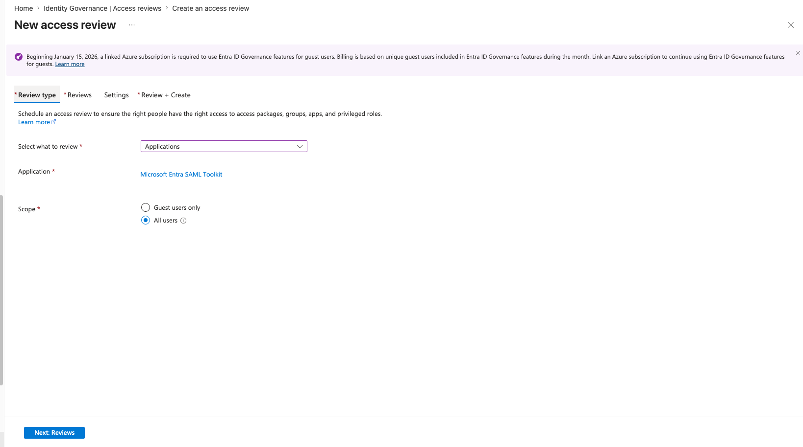

A specific reviewer (adm-provost) was named, with a quarterly recurrence. Quarterly recurring recertification is the enterprise norm; a one-time review is only a spot check.

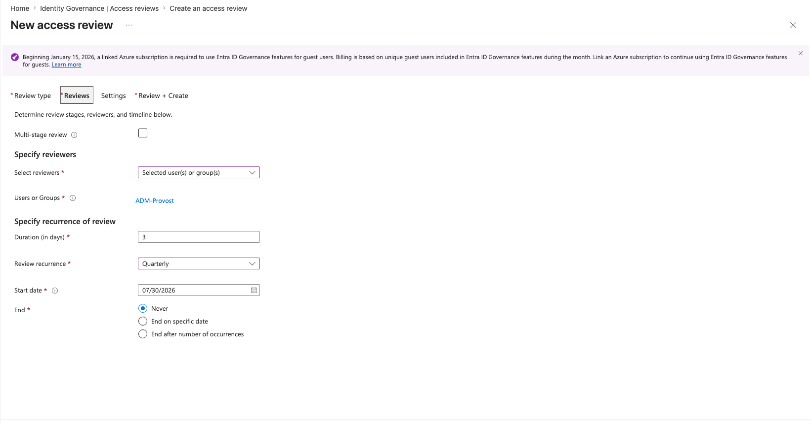

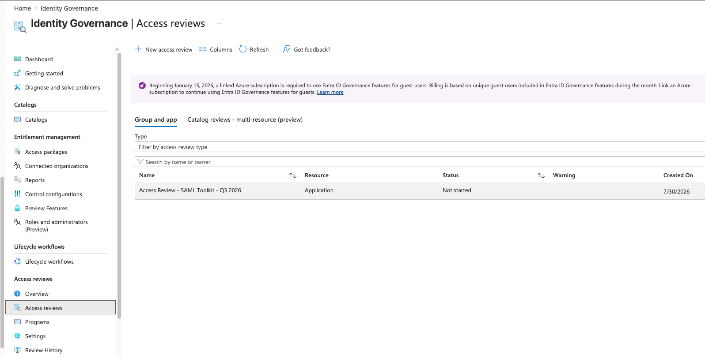

### The reviewer decision, and a judgment call worth noting

When the review became active, the decision interface presented each user with a recommendation. Entra recommended **Deny** for both users, flagging each as an inactive user based on sign-in activity.

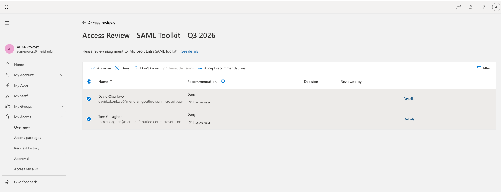

The reviewer **approved** both, overriding the recommendation.

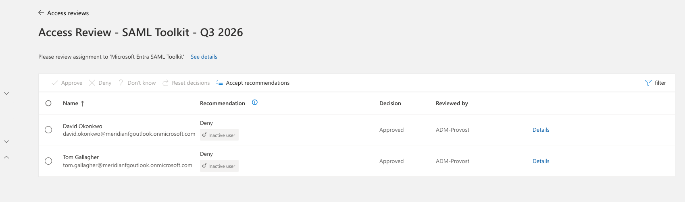

This is the point of human-in-the-loop recertification. In a fresh lab tenant the test users had minimal sign-in history, so Entra's decision helper flagged them inactive. A reviewer who blindly clicked "Accept recommendations" would have stripped access from active test accounts. Applying knowledge the automated signal did not capture, and recording a justification, is the reviewer's actual job. The decision helper informs; it does not decide.

The review produced a decision summary: two users, both approved, zero denied, all reviewed.

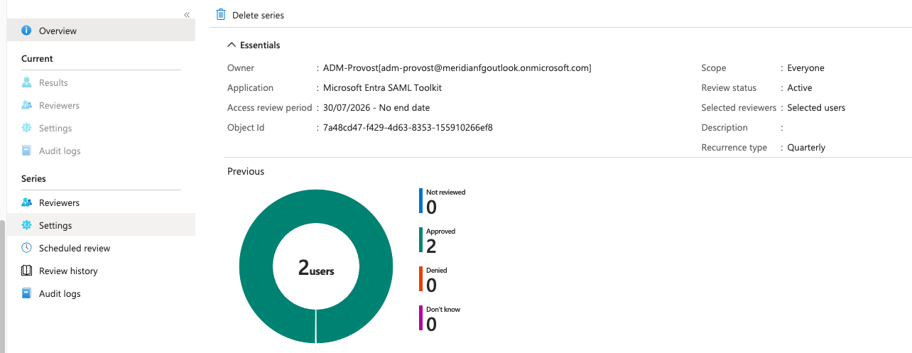

A clean 100%-reviewed result with an auditable summary is exactly the evidence a recertification is meant to generate.

### Dispositioning the dormant external account (a cross-sprint finding)

A dormant external account had been flagged in Sprint 3 and found holding standing subscription Owner in Sprint 4. Its Owner grants were removed in Sprint 4; this sprint dispositioned it formally.

The account was confirmed fully orphaned: an external identity with zero group memberships, zero assigned roles, zero licenses, and no assigned access of any kind.

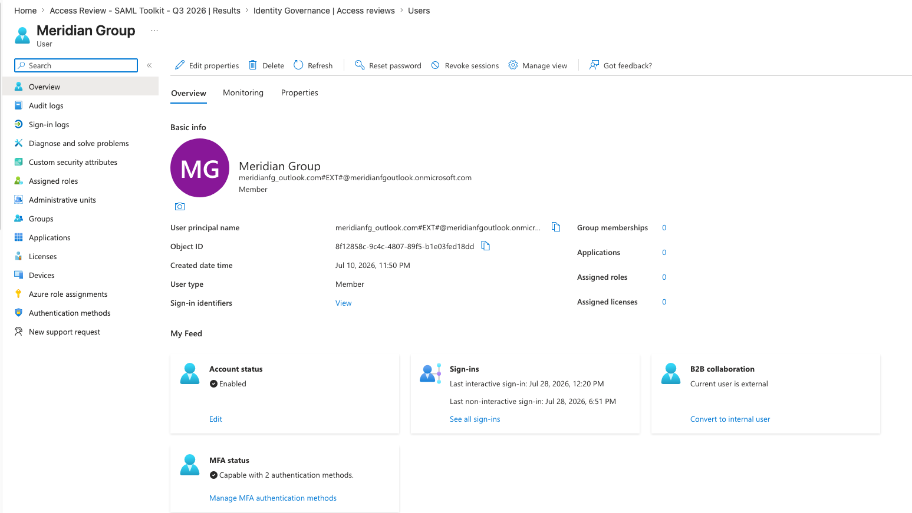

Because the account had no assigned access left to review through a group or app, and because reviewing it as a guest would trigger per-guest Governance billing, it was dispositioned directly rather than run through a guest access review. Following the disable-first-then-delete best practice, its sign-in was disabled, staged for deletion after a grace period.

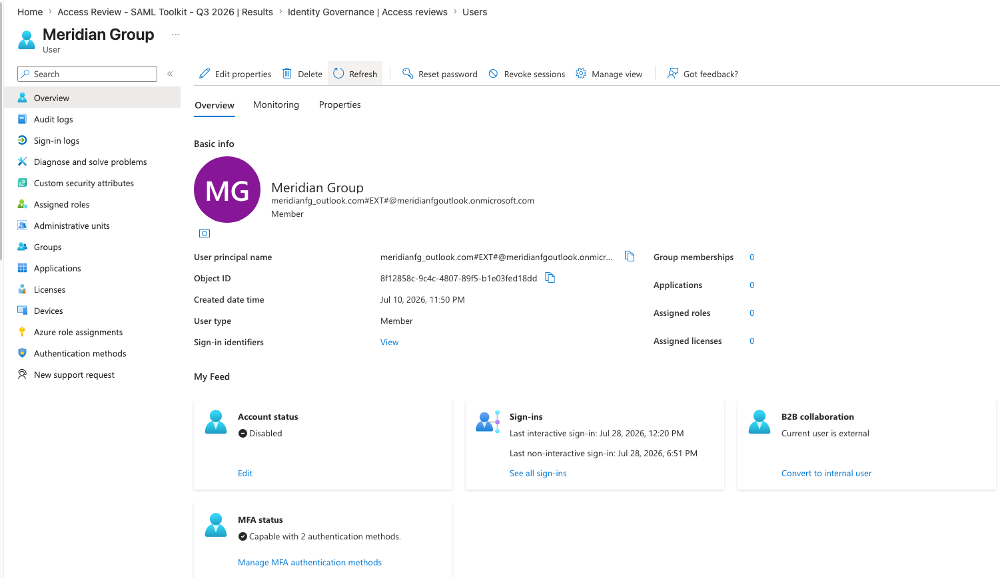

Disabling is immediately reversible and removes the account as a usable credential, while a grace period guards against cutting off any non-interactive dependency before permanent deletion. This closes a clean cross-sprint arc: detected (Sprint 3), remediated (Sprint 4), and formally dispositioned (Sprint 6). Governance working as intended: detect, remediate, recertify, remove.

---

## Part B: Entitlement Management

### The pattern

Entitlement management turns access into a self-service model. Users request an access package through a portal; a named approver decides; approved access is provisioned automatically and expires on schedule. It replaces "IT manually adds you to a group" with a governed, logged, time-boxed request flow.

### Catalog and resource

Access packages live in catalogs, which are the delegation and grouping boundary. A catalog was created, internal-only, deliberately not enabled for external users to avoid the per-guest Governance billing.

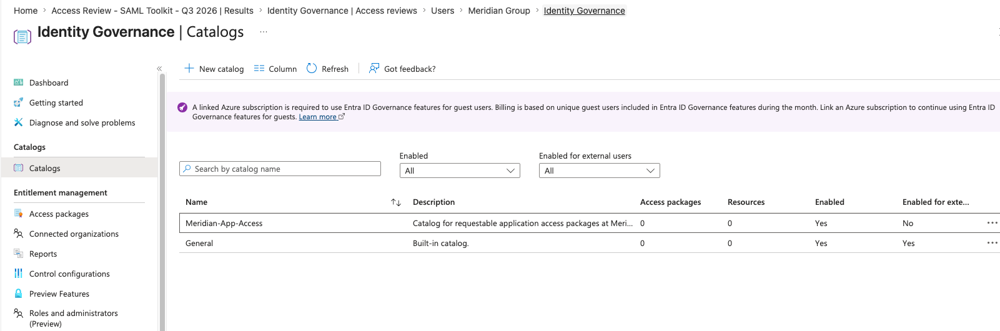

The Sprint 5 assignment group (`app-saml-toolkit-users`) was added as a catalog resource. This connects the sprints: the group drives the SAML Toolkit app (Sprint 5's group-based assignment), so governing the group governs the app.

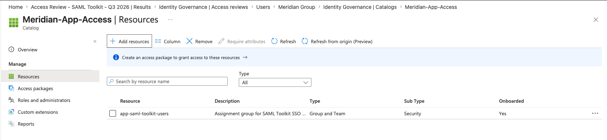

### Building the access package

The package bundles the group with a request-and-approval policy.

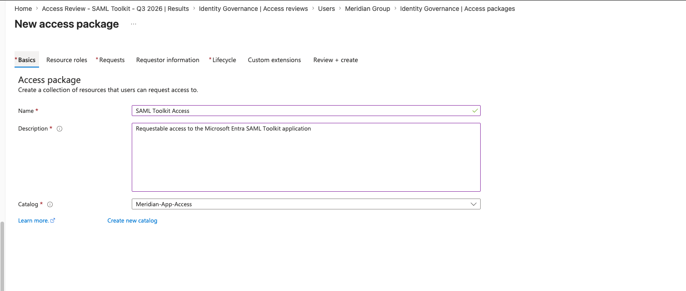

The group was added with the Member role, so approved requesters become group members and thereby gain the app.

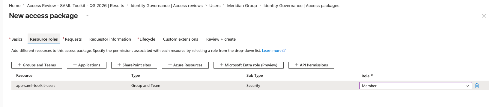

The request policy is where governance lives: who can request, whether approval is required, and justification.

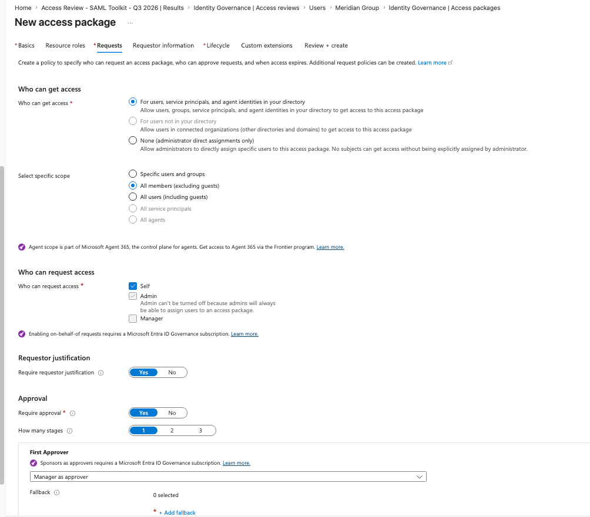

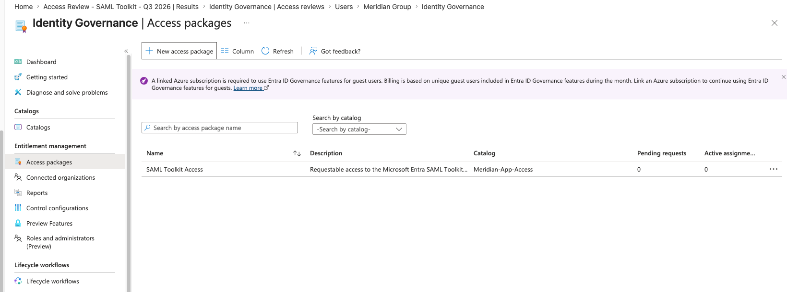

The initial policy was edited to use a specific approver, admin-approver, the same dedicated approver identity used for PIM (Sprint 4) and access reviews. One approver persona across all three governance mechanisms keeps the segregation-of-duties story consistent.

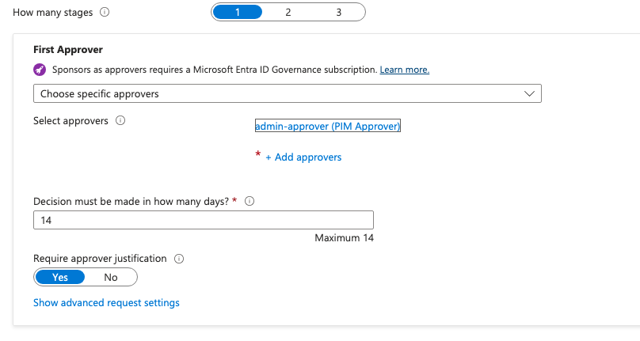

### The full request-approve-access loop

A workforce user (Aisha Bello), not previously in the group, requested the package through the My Access portal, providing a business justification.

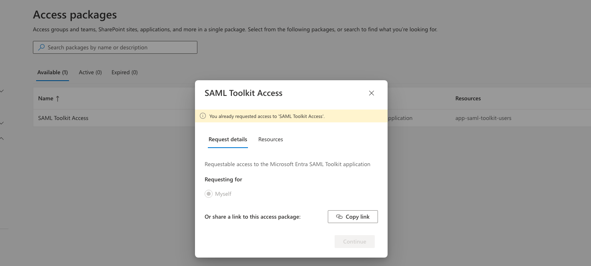

The request routed to admin-approver, a different identity from the requester (segregation of duties in action).

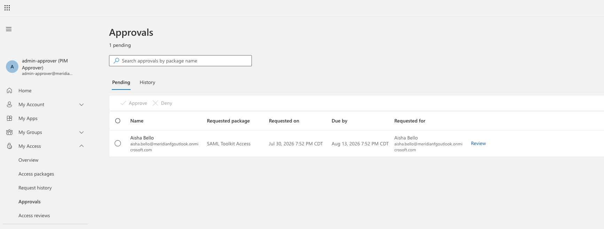

The approver approved with justification.

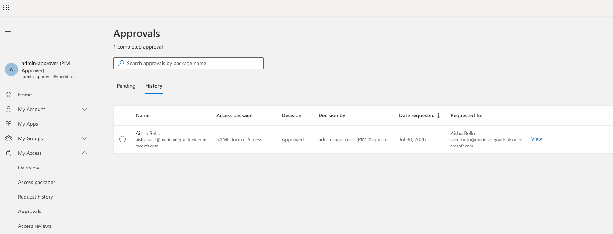

Approval automatically added Aisha to the group. The group now shows three members: Aisha (new), plus the two from Sprint 5. No manual group edit, the entitlement did it.

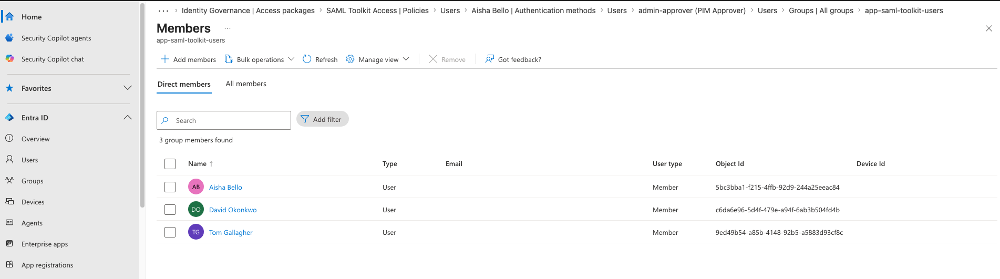

The assignment shows Delivered status with an expiration date roughly 90 days out. Access is time-boxed and will auto-expire, forcing a re-request. That is least privilege applied over time.

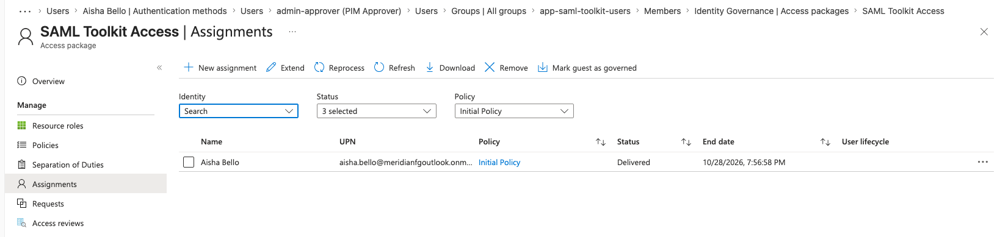

The complete chain: self-service request, separate-approver approval with justification, automatic provisioning to the group, app access via the group, and automatic expiration. Every layer connects, and it ties Sprints 5 and 6 into one governance story.

---

## Part C: Lifecycle Workflows

### The licensing boundary, documented honestly

Lifecycle Workflows require Entra ID Governance, which the P2 trial does not include. Opening the blade returned a 401.

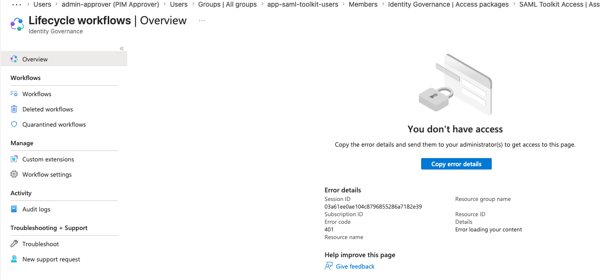

A 30-day Entra ID Governance trial (25 seats) was activated to proceed. This is the intended path for the feature; the 401 is documented as an honest licensing boundary rather than glossed over.

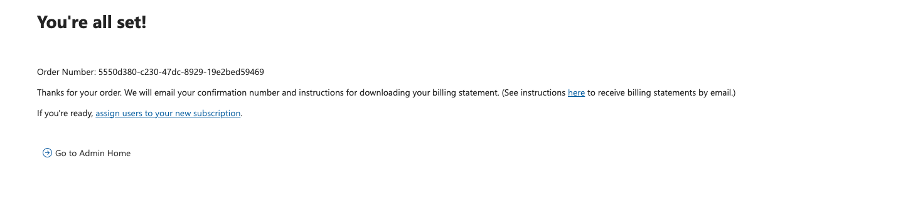

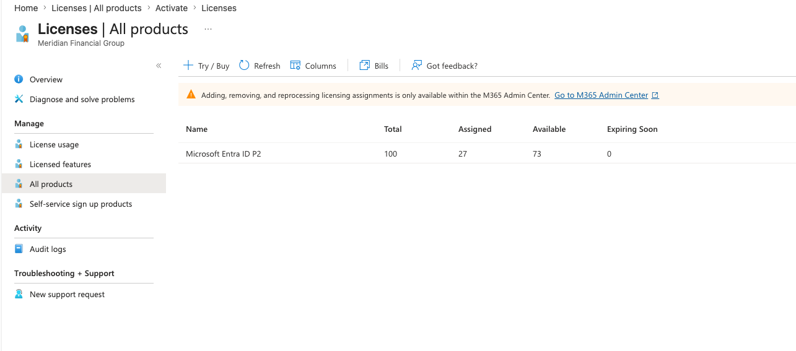

Lifecycle Workflows are licensed per governed user, so the test users the workflow acts on were licensed, not only the admin. Assigning the license only to IT admins would cause the workflow to fail on unlicensed users.

### The leaver workflow

The "Offboard an employee" template was used, a leaver workflow that triggers on the user's `employeeLeaveDateTime` and runs offboarding tasks. The default tasks are disable the account, remove from all groups, and remove from all Teams.

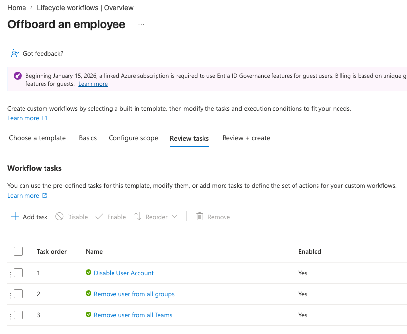

The scope was a rule matching the two test users' department, and the trigger is the leave-date attribute.

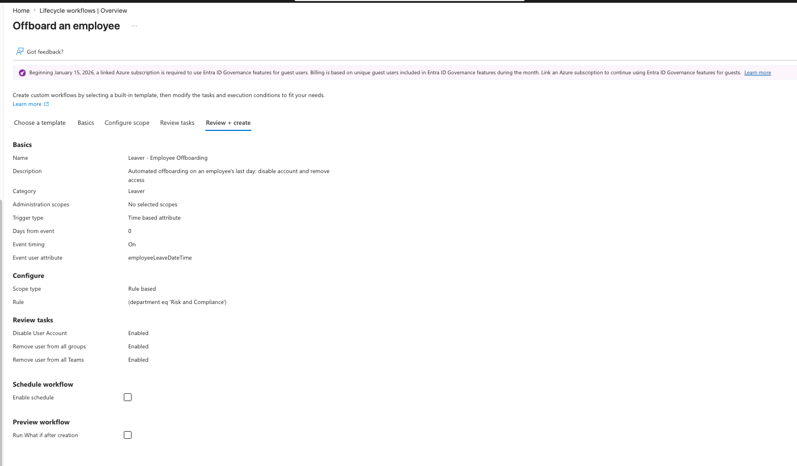

### Setting the trigger attribute via Graph PowerShell

The `employeeLeaveDateTime` attribute is not editable in the normal user UI; it is set via Graph. In production, an HR system (Workday, SuccessFactors) writes this attribute through provisioning, so a marked last-day flows into Entra and fires the workflow automatically. In the lab it was set with PowerShell.

Two lessons emerged. First, `Update-MgUser -AdditionalProperties` silently failed to write the lifecycle attribute through the SDK's typed model, so a direct `Invoke-MgGraphRequest` PATCH was used instead. Second, reading the value back through `Get-MgUser -Property` returned blank because the value lands in the typed model, not in `AdditionalProperties`; the raw Graph GET is the reliable verification. Confirm-by-evidence caught a write that appeared to fail but had actually succeeded.

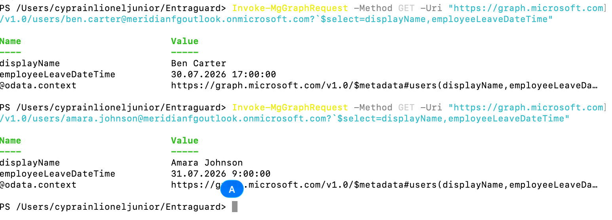

### On-demand execution (Ben Carter)

With the leave date set, the What-if preview confirmed Ben was in scope, account still enabled, zero potential task failures.

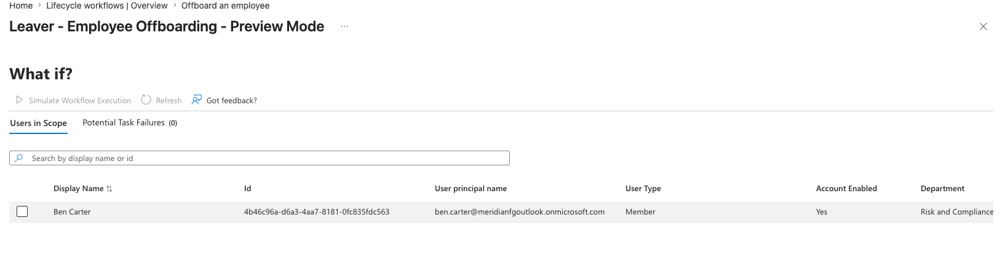

The workflow was run on-demand against Ben. All three tasks completed with zero failures.

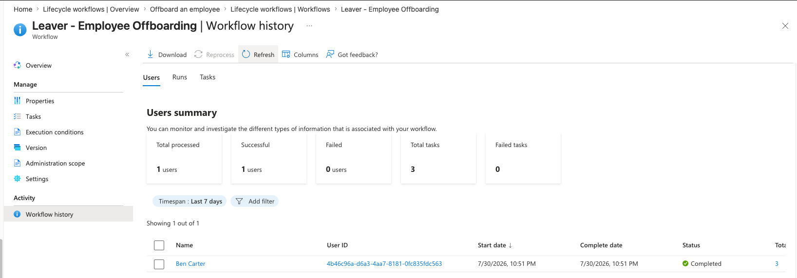

### Verification, and the dynamic-group finding

Ben's account is now disabled, the definitive access cut. But his group membership count is 1, not 0.

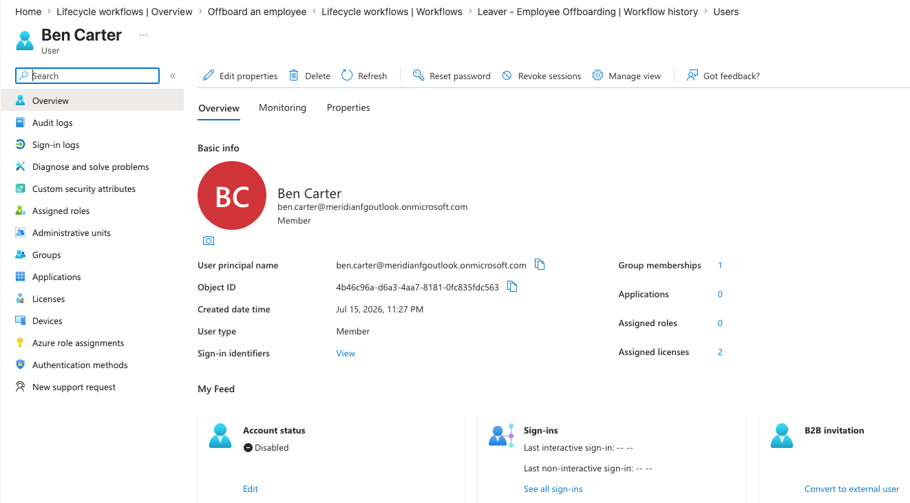

The remaining membership is `sg-dyn-risk-compliance`, a dynamic group. This is an important finding: the "remove from all groups" task removes assigned memberships, but it cannot remove a user from a dynamic group, because dynamic membership is computed from an attribute rule (`department eq 'Risk and Compliance'`). Ben still matches the rule, so the group keeps re-adding him.

The takeaway: **account disable is the reliable access cut in a leaver workflow, not group removal.** Dynamic group membership survives offboarding unless the driving attribute is also cleared. A disabled account in a group has no usable access, which is why disable is the definitive control. A complete production workflow would additionally clear or change the department attribute, and add a remove-licenses task (the template default did not include one, so Ben's licenses persisted).

### Scheduled execution (Amara Johnson)

To demonstrate the automated path, the workflow schedule was enabled. Amara's leave date was set for the following day; the enabled scheduler processes in-scope users automatically at its next cycle after the leave time.

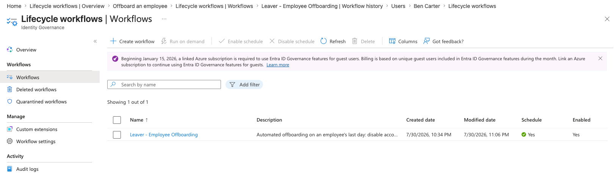

Two execution paths were demonstrated: Ben on-demand (immediate, admin-initiated, proving the tasks produce real changes) and Amara scheduled (automated, leave-date-driven, proving the trigger mechanism that makes offboarding hands-off in production).

---

## Validation

| Check | Result |
|---|---|
| Access review created, quarterly, app-scoped | Pass |
| Reviewer decisions applied with justification | Pass (approved, overriding inactive recommendation) |
| Review results summary produced | Pass (2 approved) |
| Dormant external account dispositioned | Pass (disabled, staged for deletion) |
| Catalog created, internal-only | Pass |
| Access package built with approval and expiration | Pass |
| Full request-approve-access loop | Pass (Aisha requested, approved, provisioned) |
| Access auto-expiration set | Pass (assignment expires ~90 days) |
| Governance license activated for Lifecycle Workflows | Pass |
| Leaver workflow on-demand run | Pass (Ben disabled, tasks completed) |
| Leaver workflow scheduled trigger | Pass (schedule enabled, Amara's date set) |

## Lessons Learned

- The access review decision helper recommends based on activity signals, but the human decision is the control. Blindly accepting recommendations would have removed active users. Override with recorded justification when you know better.
- Account disable, not group removal, is the definitive access cut in offboarding. Dynamic group membership is attribute-driven and survives the "remove from all groups" task.
- Lifecycle Workflows are licensed per governed user, not per admin. The users a workflow acts on must be licensed.
- The Graph SDK can silently no-op on niche lifecycle attributes via `-AdditionalProperties`; a direct `Invoke-MgGraphRequest` PATCH is reliable, and the raw GET is the trustworthy verification.
- Choosing direct disposition over a guest access review for a single orphaned account avoided triggering per-guest Governance billing.

## Enterprise Best Practices

- Run recurring (quarterly) access reviews, not one-time spot checks.
- Treat decision-helper recommendations as input, not verdicts.
- Disable dormant accounts first, delete after a grace period, never hard-delete immediately.
- Keep entitlement catalogs internal-only unless external access is genuinely needed, to control guest billing.
- Use one consistent approver identity across PIM, access reviews, and entitlement management for a clean SOD story.
- Set access-package expiration so access does not accumulate.
- In leaver workflows, rely on account disable as the access cut, and clear driving attributes for dynamic-group cleanup.
- License lifecycle workflows for every governed user, and drive the leave-date attribute from HR provisioning in production.

## Conclusion

Sprint 6 delivers all three governance pillars: access reviews that recertify and dispositioned a real orphaned account, entitlement management with a complete self-service request-approve-access-expire loop, and lifecycle workflows that automate leaver offboarding both on-demand and on schedule. Real findings run through it, the cross-sprint dormant-account arc, the dynamic-group offboarding limitation, and the honest licensing boundary, which make it a governance implementation rather than a template walkthrough. The Sprint 5 applications are now governed end to end, and the identity lifecycle is automated from request to expiration to departure.
