## Introduction

This sprint turns identity events into deterministic, coded actions. Where earlier sprints built controls a human configures and monitors, Sprint 8 builds automation that provisions, contains, and reports on its own. Three pieces: lifecycle scripts (joiner and leaver) through Microsoft Graph, an event-driven risk-response Logic App with a human approval gate, and a scheduled hygiene runbook in Azure Automation.

Every automated identity here authenticates with a managed identity. No secret is stored in any workflow. The identity that acts is Azure-managed, least-privilege, and auditable, which is the secure-by-default pattern for non-human identities and a direct continuation of the workload-identity theme from Sprint 7.

## Business Scenario

Meridian is a regulated financial firm. Two operational realities drive this sprint.

First, containment speed. A compromised account disabled in seconds instead of hours is the difference between a contained incident and a reportable breach under GLBA. Manual response does not scale and does not run at 3 a.m.

Second, audit cadence. SOX and general audit requirements expect access to be reviewed and stale accounts identified on a schedule, with evidence. A weekly report of dormant accounts is not a nice-to-have, it is the control an auditor asks to see.

The automation must also be safe from itself. Automation that can disable accounts is a target. A human approval gate keeps the workflow from becoming a denial-of-service weapon if it is triggered maliciously or misbehaves.

## Objectives

- Build joiner and leaver lifecycle automation through Microsoft Graph
- Prove attribute-driven access: setting a department cascades into dynamic group membership
- Stand up a Logic App that authenticates with a managed identity, no stored secrets
- Grant the automation identity least-privilege Graph permissions
- Build an event-driven risk-response workflow that disables and revokes sessions for risky users
- Insert a human approval gate so no account is disabled without a decision point
- Build a scheduled Azure Automation runbook that reports dormant accounts

## Certification Objectives Covered

| Exam | Domain | What this sprint proves |
|------|--------|-------------------------|
| SC-300 | Implement and manage user lifecycle | Automated joiner/mover/leaver via Graph |
| SC-300 | Plan and implement identity governance | Scheduled access hygiene reporting |
| AZ-500 | Manage identity and access | Managed identity, least-privilege app roles for automation |
| SC-200 | Automate threat response | Event-driven disable and session revocation on risk |

## Technologies Used

Microsoft Graph PowerShell SDK, Azure Logic Apps (Consumption), Azure Automation, system-assigned managed identities, Microsoft Graph application permissions, Conditional Access risk signal (from Sprint 7).

## Licensing and Cost

| Component | License / cost | Note |
|-----------|---------------|------|
| Graph lifecycle scripts | Free | No license beyond Graph access |
| Logic App (Consumption) | Pay-per-operation, pennies | Bills only when it runs |
| Risky-users query | Entra ID P2 | Uses Sprint 7 risk engine |
| Azure Automation runbook | Free tier covers it | 500 minutes/month free |
| Office 365 Outlook approval connector | Requires Exchange mailbox | Not available on P2-only trial (see AD-013) |

> **Note:** The P2-dependent piece is the risky-users query in the Logic App. That work was completed while the P2 trial was live. The rest of the sprint has no P2 dependency.

## Architecture

Two automation patterns, both on managed identities.

```
  EVENT-DRIVEN CONTAINMENT (Logic App)
  Recurrence -> query risky users (P2) -> For each ->
      Condition (approval gate) -> [True] disable + revoke sessions
  Auth: system-assigned managed identity, least-privilege Graph app roles

  SCHEDULED GOVERNANCE (Azure Automation)
  Weekly schedule -> runbook -> query users + sign-in activity ->
      report dormant accounts (no sign-in 30+ days)
  Auth: system-assigned managed identity, READ-ONLY Graph app roles

  LIFECYCLE SCRIPTS (Graph PowerShell, run on demand)
  Joiner: create user -> set department -> assign license -> auto-join dynamic group
  Leaver: disable -> revoke sessions -> transition department out of dynamic group
```

### Architecture Decision AD-011: Managed identity for all automation, no stored secrets

**Decision.** Every automated identity (Logic App, Automation Account) uses a system-assigned managed identity. No client secrets are stored in any workflow.

**Rationale.** A stored secret is a credential sitting in the automation, exactly what an attacker hunts for. A managed identity has no secret to leak or rotate; Azure supplies the token invisibly. This is the secure-by-default pattern and it applies least privilege to non-human identities, the Sprint 7 workload-identity theme carried into build.

**Consequence.** Granting Graph application permissions to a managed identity cannot be done in the portal. There is no UI for it. Permissions are assigned via Graph PowerShell app-role assignments (documented in the scripts).

### Architecture Decision AD-012: Least-privilege, differentiated by function

**Decision.** The containment Logic App gets read/write user permissions (it must disable and revoke). The hygiene runbook gets read-only permissions (it must never modify).

**Rationale.** A reporter that can only read cannot cause harm if compromised. The worst a compromised hygiene identity could do is read the user list. Differentiating write from read by function is least privilege in practice.

**Consequence.** Logic App identity holds User.ReadWrite.All and Directory.ReadWrite.All. Automation Account identity holds only User.Read.All and AuditLog.Read.All.

### Architecture Decision AD-013: Approval gate built with built-in actions, email connector documented as production integration

**Decision.** Build the human approval gate as a Condition node with built-in actions. Do not depend on the Office 365 Outlook approval connector.

**Rationale.** The Outlook "Send approval email" connector requires a REST-enabled Exchange mailbox. The P2-only trial tenant has no Exchange mailboxes (that needs an M365/Exchange license), so the connector returns MailboxNotEnabledForRESTAPI. Rather than buy licensing, the gate is demonstrated mechanically with a Condition, and the email/Teams approval is documented as the integration point a licensed tenant plugs into that same condition.

**Consequence.** The workflow proves the gate structure (action separated from detection by a decision point). The approval-response wiring is the documented production extension, matching the honest-boundary pattern from Sprint 5 SCIM and Sprint 7 workload identity.

## Step-by-Step Implementation

The sprint ran in five blocks.

### Block 1: Joiner and leaver lifecycle scripts

Both halves of lifecycle management, built through Graph and run against a disposable test user.

**Joiner.** Create a user, set department to Finance, assign a P2 license, and confirm the user auto-populates into the Finance dynamic group from Sprint 2. The whole chain ran clean, and the last line of output is the proof: `sg-dyn-finance`. The user landed in the Finance dynamic group with no manual add, driven purely by the department attribute.

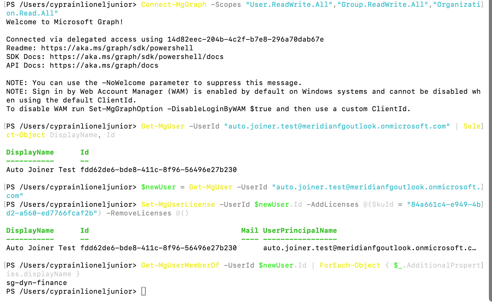
*The complete joiner chain in one view. User created, license assigned (object returned), and Get-MgUserMemberOf showing sg-dyn-finance. Attribute-driven access working end to end.*

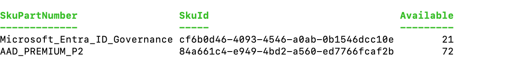
*Available license SKUs. AAD_PREMIUM_P2 with 72 seats was assigned. Note Microsoft_Entra_ID_Governance is also present with 21 seats, the add-on that would unlock Lifecycle Workflows.*

**Leaver.** Disable the account, revoke all sessions, and transition the department out of the dynamic group. Two real lessons surfaced here.

First, dynamic-group membership cannot be removed directly. Membership is controlled by the rule, so to drop a user you change the attribute that drives it, not the membership. The correct leaver action is to change the source attribute and let the rule re-evaluate.

Second, do not null an attribute to offboard. Graph rejects `$null` for department (`Invalid value specified`). The right pattern is to transition it to a defined state like "Offboarded", which both drops dynamic-group access and leaves a clean audit trail. An empty field looks like a mistake; "Offboarded" looks like a process.

After the leaver ran, `sg-dyn-finance` dropped off the user's group membership, closing the leaver loop the same way the joiner loop closed. The same attribute-driven engine that grants access on the way in revokes it on the way out.

### Block 2: Logic App with managed identity

Create the Logic App (Consumption plan), enable its system-assigned managed identity, and grant it least-privilege Graph permissions.

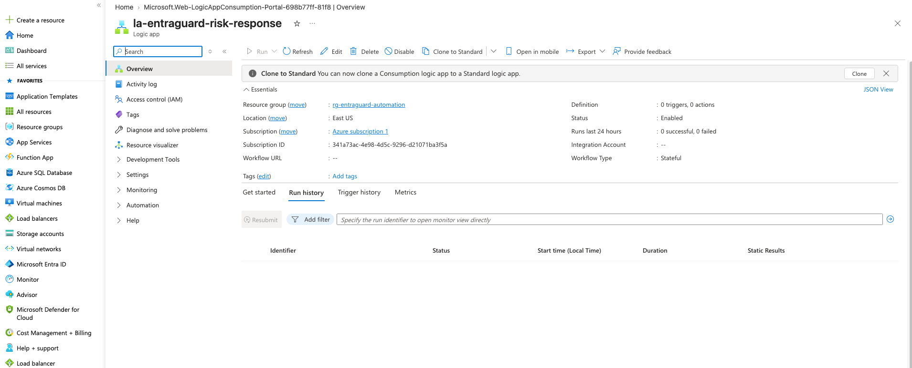
*la-entraguard-risk-response, Consumption plan, deployed. Creating the resource group first required an Azure RBAC role (activated via PIM), a reminder that Entra admin roles do not grant Azure resource permissions.*

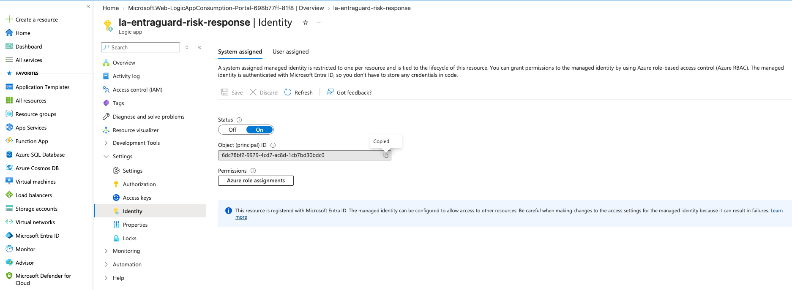
*System-assigned managed identity On, with its Object (principal) ID. This identity, not a stored secret, is what the workflow authenticates as.*

Granting Graph application permissions to a managed identity has no portal UI. It is done via Graph PowerShell app-role assignments.

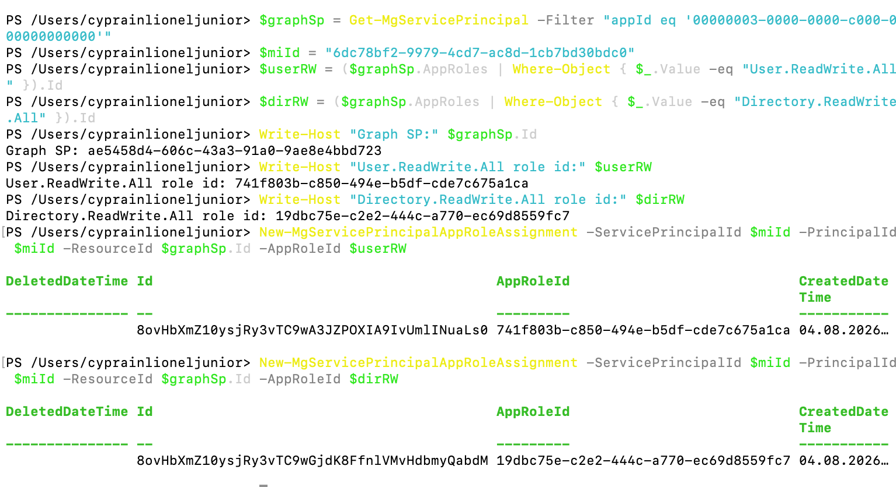
*User.ReadWrite.All and Directory.ReadWrite.All assigned to the managed identity. Exactly what the workflow needs to disable a user and revoke sessions, nothing broader.*

### Block 3: Risk-response workflow

Build the workflow: Recurrence trigger, HTTP query for high-risk users (managed-identity auth), a For each loop, and inside it the disable (PATCH accountEnabled false) and revoke sessions (POST revokeSignInSessions) actions.

Tested against a controlled test account by temporarily pointing the query at a specific user. The workflow ran and disabled the target.

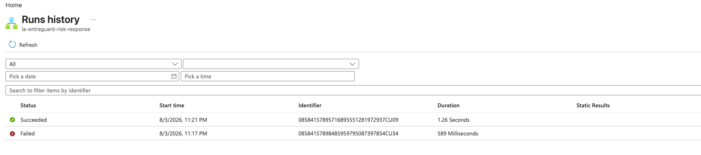
*Run history showing a successful execution. The workflow queried, looped, and acted end to end.*

### Block 4: Human approval gate

Insert a Condition node before the disable, moving disable and revoke into the True branch. Only when the condition is satisfied do the containment actions fire. This separates detection from action, the SOX-defensible control.

The Outlook approval connector was attempted first but returned MailboxNotEnabledForRESTAPI, the P2-only tenant has no Exchange mailbox. The gate was built with a built-in Condition instead (AD-013).

This block surfaced the sprint's hardest bug. The condition kept skipping the disable even though the True branch was highlighted. The root cause was a type mismatch: the condition compared the boolean `accountEnabled` against the string `"True"` (quoted). A string never equals a boolean, so the condition always failed and the disable never ran. Changing `"True"` to `true` (unquoted boolean) fixed it immediately.

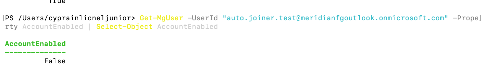
*AccountEnabled False after the gated run. The condition evaluated true, the True branch fired, and the account was disabled. The full gated chain works.*

### Block 5: Scheduled hygiene runbook

Create an Azure Automation Account, enable its managed identity, grant read-only Graph permissions, write a PowerShell runbook that reports dormant accounts, and schedule it weekly.

Creating the Automation Account first required registering the Microsoft.Automation resource provider on the subscription, a one-time subscription-scope action separate from resource-group RBAC.

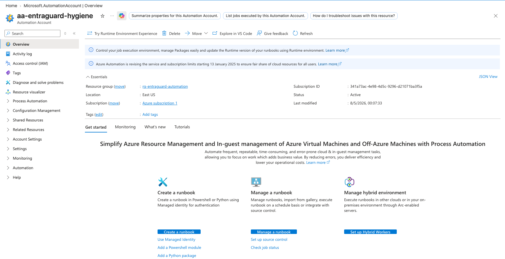
*aa-entraguard-hygiene deployed after registering the Microsoft.Automation resource provider.*

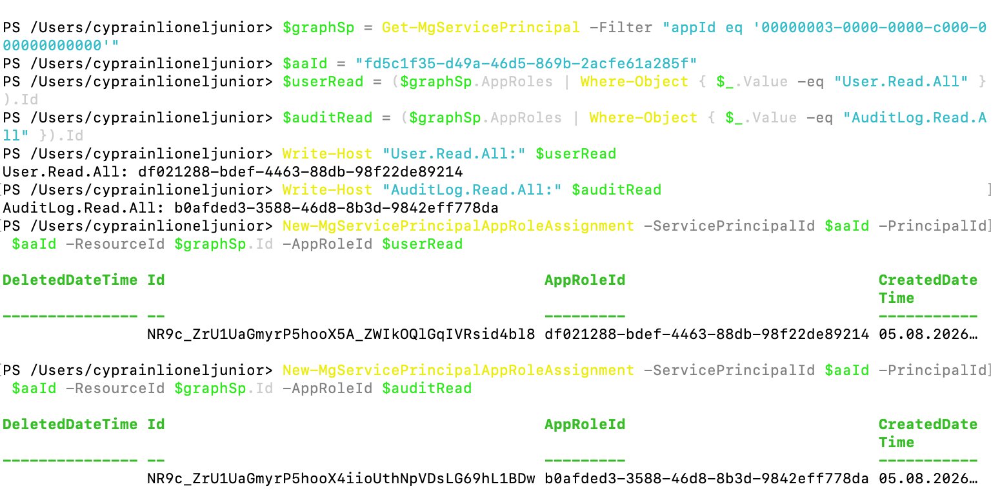
*User.Read.All and AuditLog.Read.All assigned to the Automation Account identity. Read-only by design, a reporter that can look but never touch.*

The runbook connects as the managed identity (`Connect-MgGraph -Identity`), queries enabled member accounts with their last sign-in, and flags any with no sign-in in 30+ days. The Graph modules had to be imported into the Automation Account first (Microsoft.Graph.Authentication, then Microsoft.Graph.Users, in dependency order).

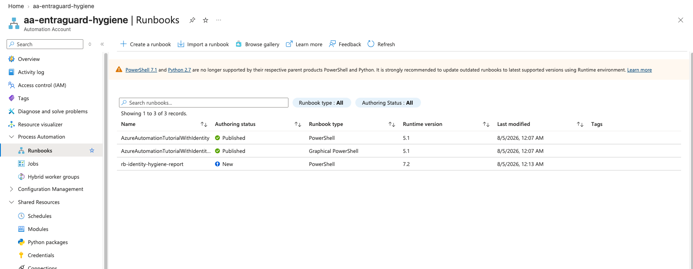
*The runbook found 17 dormant accounts out of 27 enabled members, all never signed in. These are the Sprint 2 workforce users created for structure. In a real tenant, never-signed-in accounts created weeks ago are exactly the dormant signal an auditor wants surfaced.*

Publish the runbook, then attach a weekly schedule.

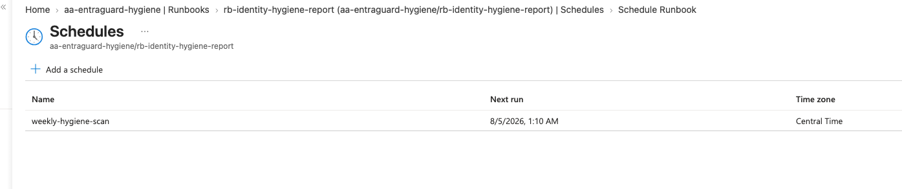
*weekly-hygiene-scan schedule linked to the runbook. The hygiene report now runs itself every week, producing an audit-ready dormant-accounts list with no human involved.*

## Attacker and Defender Framing

| Attacker technique | Defender control this sprint builds |
|--------------------|-------------------------------------|
| Compromised account used before manual response | Event-driven disable + session revocation in seconds |
| Stolen token replayed after account disabled | revokeSignInSessions kills active tokens immediately |
| Dormant account revived and used quietly | Weekly hygiene report surfaces never-used accounts |
| Automation itself triggered as a DoS weapon | Human approval gate; no disable without a decision point |
| Stored secret in a workflow harvested | Managed identity, no secret to steal |
| Over-permissioned automation identity abused | Least privilege differentiated by function (read vs write) |

**Real-world example.** The joiner/leaver symmetry is the core of enterprise lifecycle management. Setting one attribute (department) cascades into group membership and, through group-based licensing, access. Clearing or transitioning that attribute revokes it. Automating both directions removes the manual gap where an offboarded employee keeps access because someone forgot to remove a group.

## Validation

| Outcome | How confirmed | Evidence |
|---------|--------------|----------|
| Joiner creates user and auto-joins dynamic group | sg-dyn-finance in membership | 106 |
| License assigned via Graph | Set-MgUserLicense returned the user object | 106, 107 |
| Leaver removes dynamic-group access | sg-dyn-finance gone after department transition | (terminal, confirmed) |
| Logic App uses managed identity | Identity On, principal ID generated | 109 |
| Least-privilege Graph grants (Logic App) | Two app-role assignments returned | 110 |
| Workflow disables risky user | AccountEnabled False after run | 112 |
| Approval gate branches correctly | True branch fired only when condition met | 112 |
| Runbook reports dormant accounts | 17 of 27 flagged, all never signed in | 115 |
| Runbook scheduled weekly | weekly-hygiene-scan linked | 116 |
| Read-only grants (runbook) | Two read-only app-role assignments | 114 |

## Cross-Reference to the Azure Zero Trust SOC Lab

The risk-response workflow consumes the same Identity Protection signal that feeds Sentinel UEBA in the SOC lab. Here the signal drives automated containment at the identity layer; in the SOC lab it drives detection and correlation. The disable-and-revoke pattern is the identity-side response that complements the SOC lab's investigation workflow. A mature deployment runs both: automated containment for speed, SIEM correlation for context.

## Lessons Learned

- **Graph SDK module versions must match.** Mixing 2.38 and 2.39 sub-modules caused repeated "assembly already loaded" and "cmdlet not recognized" errors. The fix was pinning every sub-module to one version (2.39). This cost real time and is the single most common Graph SDK headache. The finished scripts include an explicit module-import header to prevent it.
- **Dynamic-group membership is attribute-driven, both ways.** You cannot remove a user from a dynamic group directly. Change the source attribute and let the rule re-evaluate. And do not null the attribute; transition it to a defined offboarding state for a clean audit trail.
- **Entra admin roles do not grant Azure resource permissions.** Creating the Logic App's resource group required an Azure RBAC role activated via PIM. Entra and Azure RBAC are separate permission systems.
- **Resource providers must be registered per subscription.** Creating the Automation Account required registering Microsoft.Automation first, a subscription-scope action distinct from resource-group RBAC.
- **The Outlook approval connector needs an Exchange mailbox.** A P2-only trial has none. The gate was built with built-in actions and the email approval documented as the production integration.
- **Logic App conditions compare types strictly.** The string `"True"` never equals the boolean `true`. This one type mismatch cost the most debugging time in the sprint and is the highest-value lesson: when a condition silently skips, check the data types on both sides.
- **Graph omits fields unless you $select them.** The `accountEnabled` field was absent from the query response until explicitly selected, which is why the condition could not read it at first.
- **Granting app permissions to a managed identity has no portal UI.** It is done via Graph PowerShell app-role assignments.

## Enterprise Best Practices

- Use managed identities for all automation. Never store secrets in workflows.
- Apply least privilege to automation identities, differentiated by function. A reporter gets read-only.
- Gate destructive automation behind a human decision point. Automation that can disable accounts must not run unchecked.
- Pin Graph SDK module versions in scripts to avoid version-clash failures.
- Offboard by transitioning attributes to defined states, not by nulling them, for audit clarity.
- Run access hygiene on a schedule and keep the output as audit evidence.

## Conclusion

Sprint 8 builds a complete identity automation stack: lifecycle scripts that provision and deprovision through attribute-driven Graph calls, an event-driven Logic App that contains risky accounts in seconds behind a human approval gate, and a scheduled runbook that surfaces dormant accounts for audit. Every automated identity runs on a managed identity with least-privilege permissions and no stored secrets. The sprint fought back hard, module version clashes, RBAC scope walls, a resource-provider registration, a mailbox licensing boundary, and a string-versus-boolean condition bug, and each obstacle became a documented lesson. Meridian now has both halves of operational identity automation: containment for speed and governance for cadence.
