## Introduction

Standing administrative access is the single largest identity risk in a cloud tenant. A Global Administrator account that holds its role permanently is a target that pays off around the clock. Steal its session token at 2am and the attacker owns the tenant instantly, no further gate to clear.

Sprint 4 removes that liability. Using Microsoft Entra Privileged Identity Management (PIM), every high-privilege role converts from standing (permanent, always active) to eligible (activated just-in-time, time-boxed, MFA-verified, justified, and for the top role, human-approved). This writeup documents the Entra directory role work end to end, including a real lockout scenario that put the break-glass accounts to genuine use.

## Business Scenario

Meridian Financial Group is a regulated financial firm. An external SOX auditor asks a direct question: who can access production financial systems right now, and how do you prove each access was justified?

With standing Global Administrator assignments, the honest answer fails the audit: several people, all the time, no per-use justification. PIM changes the answer to a defensible control. Nobody holds Global Admin standing. A small number of people are eligible. Each activation is time-boxed, MFA-verified, justified in writing, approved by a separate person, and logged. That is a SOX segregation-of-duties and least-privilege control an auditor can trace.

## Objectives

1. Configure PIM role settings for Global Administrator: short activation window, MFA, justification, and approval by a named separate approver.
2. Convert `adm-provost` from standing Global Admin to eligible.
3. Prove the full request, approve, activate flow with segregation of duties between requester and approver.
4. Capture the audit evidence chain for portfolio and compliance use.

## Technologies Used

- Microsoft Entra ID P2 (PIM requires P2 or Entra ID Governance)
- Microsoft Entra Privileged Identity Management
- Microsoft Entra admin center (entra.microsoft.com)
- FIDO2 passkeys and Microsoft Authenticator (auth methods from Sprint 3)

## Architecture

The privileged access model separates three distinct identities, each with one job:

| Identity | Role | Standing access | Purpose |
|---|---|---|---|
| `adm-provost` | Global Administrator | None (eligible only) | Daily admin work, activates JIT when needed |
| `admin-approver` | None (approver only) | None | Approves GA activations, holds no directory roles |
| `bg-emergency-01` / `-02` | Global Administrator | Permanent, by design | Break-glass recovery, excluded from routine flows |

The approver holding zero directory roles is deliberate. Microsoft's model allows a PIM approver to have no role at all, which keeps the approver's own standing attack surface at zero while still gating the most dangerous role in the tenant.

---

## Step-by-Step Implementation

### Part A: Create the dedicated approver identity

Segregation of duties requires that the person who approves a privileged activation is not the person requesting it. In a solo lab this means a second admin identity has to exist purely to act as approver.

A new user, `admin-approver`, was created via the portal with zero directory roles and zero standing access. Its only function is to sit in the approver pool for Global Administrator.

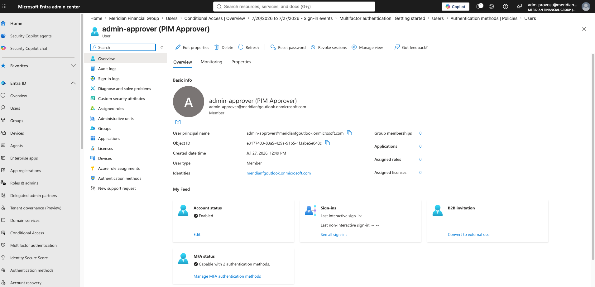

The account shows 0 assigned roles and 0 group memberships, exactly as intended. It was later assigned Entra ID P2 (required for any account participating in PIM) and a FIDO2 passkey to match the Tier 0 authentication standard used by break-glass and `adm-provost`.

**Design decision:** the approver holds no role because Microsoft's PIM model does not require approvers to hold any directory role. This keeps the approver's standing privilege at zero while still enabling it to gate activations.

### Part B: Configure Global Administrator role settings

Role settings define the policy every activation of that role must follow. These are set before anyone is made eligible, so the gate is live the moment eligibility exists.

Path: **ID Governance > Privileged Identity Management > Microsoft Entra roles > Roles > Global Administrator > Role settings > Edit**.

The following were configured on the Activation tab:

| Setting | Value | Rationale |
|---|---|---|
| Activation maximum duration | 2 hours | Short window shrinks attacker usable time |
| On activation, require | Azure MFA | Fresh proof of identity per use |
| Require justification | On | Written audit reason for every activation |
| Require approval to activate | On | Human gate on the most dangerous role |
| Selected approver | `admin-approver` | Separate identity from any requester |

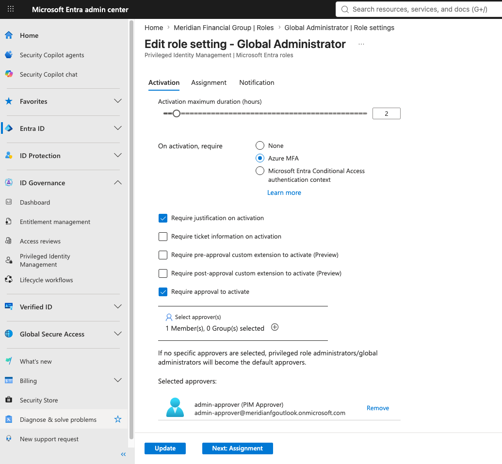

The callout on this screen is worth noting: if no specific approver is selected, Privileged Role Administrators and Global Administrators become default approvers. Naming `admin-approver` explicitly avoids that fallback and enforces the intended separation.

### Part C: Make adm-provost eligible

With the policy in place, `adm-provost` was added as an eligible assignment for Global Administrator.

Path: **Global Administrator > Assignments > Add assignments > select `adm-provost` > Assignment type: Eligible**.

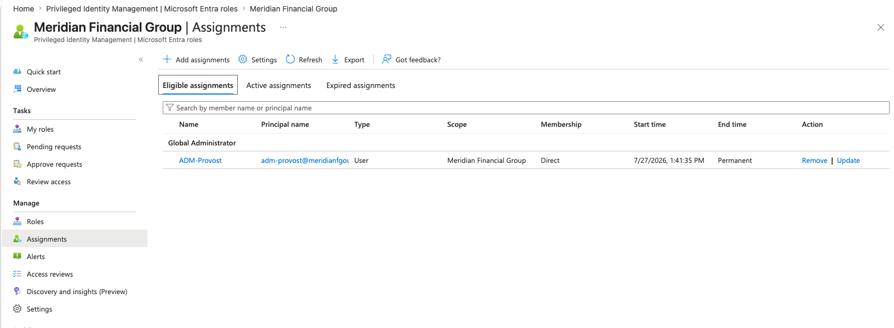

Eligible means `adm-provost` can activate the role on demand but does not hold it standing. Every activation still runs through the 2-hour window, MFA, justification, and approval defined in Part B.

At this point `adm-provost` intentionally held both a standing assignment (the original permanent GA, kept as a safety net) and the new eligible assignment. The standing one would be removed only after the activation flow was proven.

### Part D: The lockout finding

The first activation attempt failed. PIM returned an error stating the role was already active.

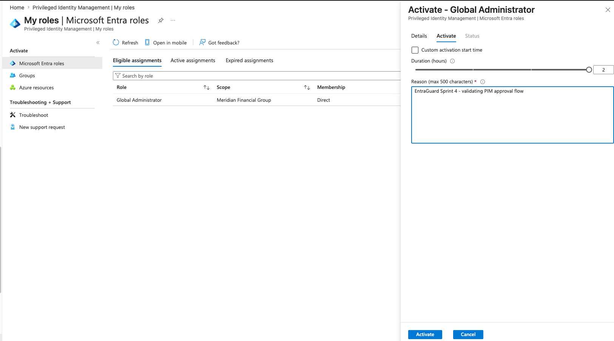

**Root cause:** `adm-provost` still held the standing (permanent) Global Admin assignment. PIM will not activate a role the user already holds, so the eligible activation had nothing to grant. The safety-net assignment blocked the very test it was meant to protect.

The standing assignment had to be removed before activation could work. This is where the session hit a genuine obstacle worth documenting.

**Neither `adm-provost` nor `admin-approver` could remove the standing assignment.** The removal was completed using a break-glass account.

Why each account failed:

| Account | Could remove standing GA? | Reason |
|---|---|---|
| `adm-provost` | No | Self-referential block removing its own standing access |
| `admin-approver` | No | Holds zero directory roles by design, no rights to manage assignments |
| `bg-emergency-01` | Yes | Permanent standing GA outside PIM management, unconflicted authority |

**Takeaway:** break-glass accounts are not only a lockout recovery path. They are the clean-hands account for privileged-assignment surgery during a PIM cutover. This validated the Sprint 1 decision to keep two permanent-active GA break-glass accounts with device-bound FIDO2 passkeys. Their first real use was not a fire drill, it was a genuine operational need during this cutover.

### Part E: Activation, routed to the approver

With standing access removed, `adm-provost` retried the activation. This time it succeeded in reaching the pending state rather than erroring. The request routed to `admin-approver`.

Signed in as `admin-approver`, the pending request appeared under **Approve requests > Microsoft Entra roles > Requests for role activations**.

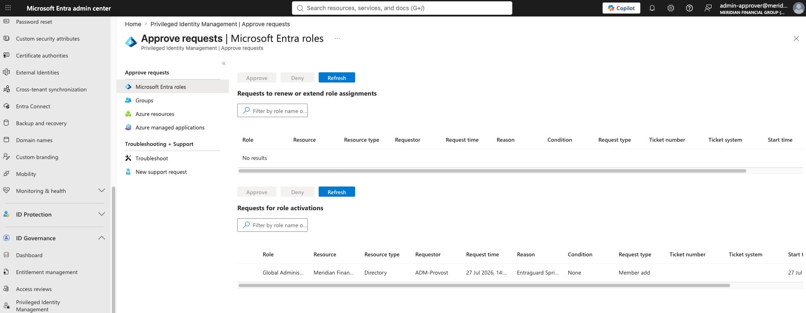

The request shows the requester (ADM-Provost), the role (Global Administrator), and the justification carried through from the activation. Segregation of duties is now visible in action: the requester cannot see or approve this from their own account, and PIM blocks self-approval by design.

### Part F: Approval decision

The approver opened the request, reviewed the details, and approved with a written justification.

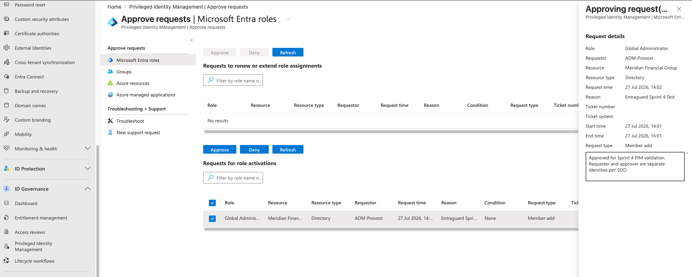

The request details confirm the 2-hour time box was applied: start 14:01, end 16:01. That window is the role settings from Part B enforcing themselves. The approver entered a justification tying the decision to Sprint 4 validation and noting requester and approver are separate identities per SOD.

### Part G: Role active and time-boxed

Back on the requester side as `adm-provost`, the role showed as activated with a hard expiry.

Path: **My roles > Microsoft Entra roles > Active assignments**.

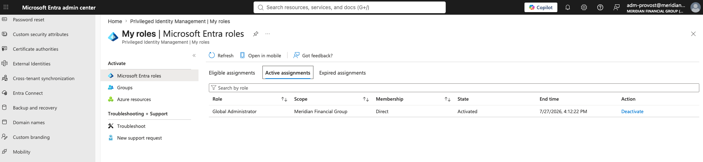

The State column reads **Activated**, not Permanent, and the End time shows 4:12:22 PM. Compare this to the start of the session, where the same role read Permanent with no end time. That single field change is the entire point of the sprint: standing privilege became time-boxed, just-in-time, approved access.

---

## Validation

| Check | Result | Where confirmed |
|---|---|---|
| No standing GA on adm-provost | Pass | Active assignments shows Activated with expiry, not Permanent |
| Role settings enforce MFA, justification, approval | Pass | Global Administrator role settings, Activation tab |
| Named separate approver configured | Pass | admin-approver listed as approver |
| Eligible assignment exists | Pass | Eligible assignments tab shows adm-provost |
| Activation request generated | Pass | Pending request visible to approver |
| Self-approval blocked, routed to separate approver | Pass | admin-approver saw the request, adm-provost could not self-approve |
| Approval logged with justification | Pass | Approval decision panel |
| Role activated and time-boxed to 2h | Pass | Activated state, 14:01 to 16:01 window |
| Break-glass functional | Pass | bg-emergency-01 removed standing assignment when other accounts could not |

## Lessons Learned

**The safety net can block the test.** Keeping standing GA as a fallback while building the eligible path is the correct cautious order, but the standing assignment prevents the eligible activation from succeeding (role already active). Plan to remove standing once the eligible path and approver are confirmed, not before, and expect the first activation to fail until you do.

**Break-glass is an operational tool, not just a break-in-case-of-fire relic.** Neither the converting account nor the role-free approver could remove the standing assignment. Break-glass had the unconflicted authority. This was the accounts' first real use and it validated the two-permanent-GA design from Sprint 1.

**A role-free approver is a feature.** Giving `admin-approver` zero directory roles keeps its standing attack surface at zero while still letting it gate the tenant's most dangerous role. Microsoft's model supports this deliberately.

**Deactivate when done, do not wait for expiry.** Manually deactivating a role when work finishes is the habit that makes JIT real. Note the 5-minute minimum before deactivation is allowed.

## Enterprise Best Practices

- Never make break-glass accounts eligible. They stay permanent-active, FIDO2-protected, excluded from Conditional Access, and monitored for any sign-in.
- Gate approval on the crown-jewel roles only (Global Admin, Privileged Role Admin). Over-gating lower roles trains people to route around the control.
- Keep requester and approver as separate identities. In a financial firm this is the whole point of SOD.
- Use short activation windows. Two hours for the top roles. Long windows recreate standing privilege by another name.
- Convert your own admin account last, after proving the flow with the approver in place and break-glass confirmed working.

## Conclusion

Sprint 4 turns the tenant's privileged access from a standing liability into a governed, just-in-time control. Combined with the Conditional Access foundation from Sprint 3, Meridian now enforces both how users authenticate and when admins actually hold power. The lockout finding during cutover proved the break-glass design under real conditions rather than in theory.

Remaining Sprint 4 work: lower-tier Entra role settings (Security Admin, User Admin), PIM for Azure resource roles, and a review of PIM alerts. Stale eligibility will be addressed by access reviews in Sprint 6.
This is the second half of Sprint 4. Part 1 covered the Global Administrator just-in-time flow with approval. This part extends PIM to the lower-tier directory roles, then to the Azure resource plane, where it turned up a real standing-privilege finding. It closes with a post-cutover alert review.

---

## Objectives

1. Tier the directory roles: apply PIM to User Administrator and Security Administrator with settings appropriate to each role's blast radius.
2. Convert a real operational admin (Patricia Nguyen, User Administrator) from standing to eligible.
3. Extend PIM to Azure resource roles (subscription Owner), which the Entra role work does not touch.
4. Remediate any standing-privilege findings surfaced during the Azure audit.
5. Review PIM alerts as a post-cutover operating check.

---

## Part A: Tiering the directory roles

The core PIM principle is that no admin role should be standing. Part 1 handled Global Administrator. But Global Admin is not the only privileged directory role. User Administrator can reset passwords across the org. Security Administrator can change security policy, including Conditional Access. A standing assignment on either is a side door left open after the front door was locked.

The tiering decision is that activation duration tightens as a role's blast radius grows, and approval is reserved for the crown-jewel roles only. Gating every role behind approval trains admins to route around the control, so operational roles get MFA and justification without an approval gate.

The result is a three-level gradient:

| Role | Activation duration | MFA | Justification | Approval |
|---|---|---|---|---|
| Global Administrator | 2 hours | Yes | Yes | Yes |
| Security Administrator | 4 hours | Yes | Yes | No |
| User Administrator | 8 hours | Yes | Yes | No |

The more a role can damage, the shorter its leash, and the top tier adds a human gate.

### User Administrator settings

Path: **ID Governance > Privileged Identity Management > Microsoft Entra roles > Roles > User Administrator > Role settings**.

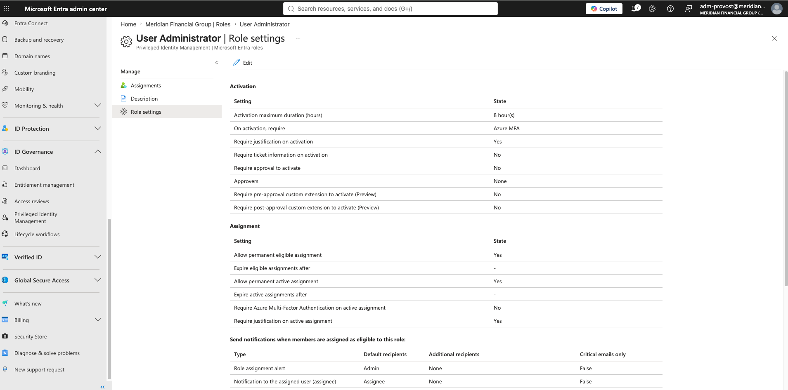

Eight hours reflects an operational role used across a full workday. MFA and justification are on; approval is off.

### Converting Patricia Nguyen to eligible

Patricia held User Administrator as a standing assignment. She was converted using the same lockout-safe order from Part 1: add the eligible assignment first, confirm it, then remove the standing one.

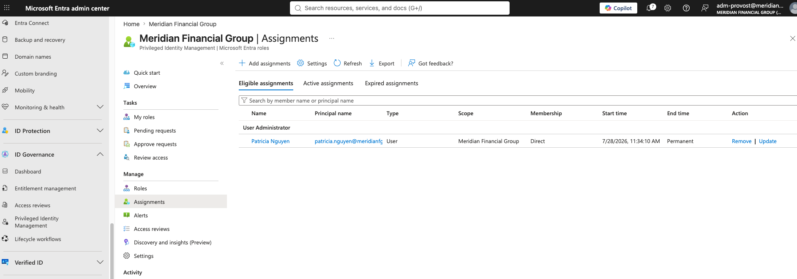

Her standing assignment was then removed. Unlike the Global Admin conversion in Part 1, this removal completed cleanly without a break-glass account. The reason is instructive: the removal was performed by `adm-provost`, which outranks User Administrator and is a different account from the one being converted. Part 1's break-glass requirement came from a self-referential block, an account trying to remove its own standing access. Removing a subordinate role on a different account does not hit that block.

### Security Administrator settings

Path: **Roles > Security Administrator > Role settings**.

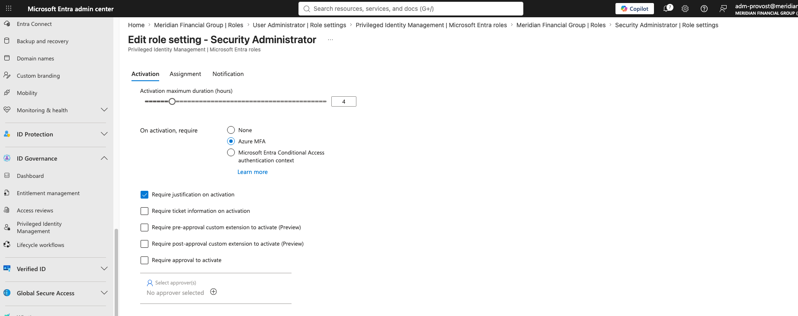

Security Administrator is more sensitive than User Administrator because it can alter security policy, so it gets a tighter 4-hour window. It remains below the approval tier because it is an operational role the security team uses regularly.

No one currently holds Security Administrator, so no assignment was created. The role settings sit configured and the role sits empty. This is deliberate hygiene: the guardrail exists before anyone walks through the gate, so the day someone needs the role, they receive it just-in-time under a policy that is already in place. An empty privileged role with pre-configured settings is a stronger posture than an unconfigured one waiting to be set up under time pressure.

---

## Part B: Azure resource PIM and a standing-privilege finding

Everything to this point governs Entra directory roles, which control the identity plane. The Azure subscription is a separate permission system. Azure resource roles (Owner, Contributor) are governed independently, and Entra role PIM does nothing for them. Skipping this would leave a visible gap: identities secured, but subscription ownership left standing.

### The audit

Opening the subscription in PIM used the current ARM-API experience (no manual onboarding required; the legacy "Discover resources" path is still available via a banner link). The subscription scope resolved without needing the root-access elevation toggle.

Auditing the Owner assignments in Access Control (IAM), the authoritative RBAC view, surfaced a finding.

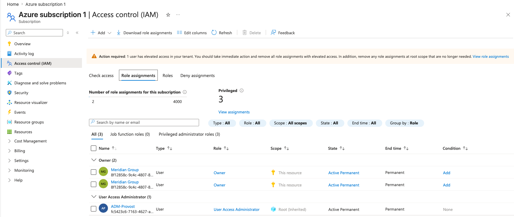

Two observations:

1. **Azure itself flagged the problem.** The warning banner reads that one user has elevated access and advises removing standing role assignments with elevated access.

2. **The account holding standing Owner was the dormant external account.** The two Owner assignments both belonged to `meridianfg_outlook.com#EXT#@meridianfgoutlook.onmicrosoft.com`, an external MicrosoftAccount identity with zero authentication methods, zero licenses, and zero group memberships. This is the same dormant guest-format account flagged in Sprint 3 for the Sprint 6 access reviews. It is the original account used to bootstrap the subscription.

An external, MFA-less, dormant account holding standing Owner over the entire subscription is a textbook standing-privilege risk, and exactly the kind of over-privileged stale identity an auditor hunts for in a regulated financial tenant. The IAM view confirmed the two Owner rows were genuine assignments, not a display artifact of the newer PIM experience.

### Remediation

The remediation followed the safety rule for subscription Owner: never remove the last path to Owner without a confirmed replacement. The sequence was:

1. Grant `adm-provost` (the controlled, MFA-protected admin) Owner on the subscription, establishing a safe management path.
2. Remove both of the external account's Owner assignments.
3. Convert `adm-provost`'s Owner from standing to PIM-eligible, so even the admin does not hold standing Owner.

The external account's directory identity was left in place, still flagged for the Sprint 6 access reviews. Only its subscription Owner role was removed. Deleting the identity is a separate decision for the access-review sprint.

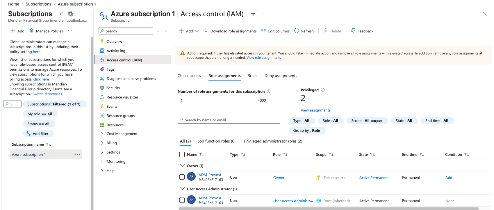

The privileged assignment count dropped from four to two. The residual "elevated access" banner now refers to `adm-provost`'s User Access Administrator inherited from root scope, which is the elevation path used to perform this work. That is a separate root-scope item, noted for later cleanup rather than removed here.

### Converting adm-provost Owner to eligible

Owner role settings were configured before the assignment, matching the Security Administrator tier.

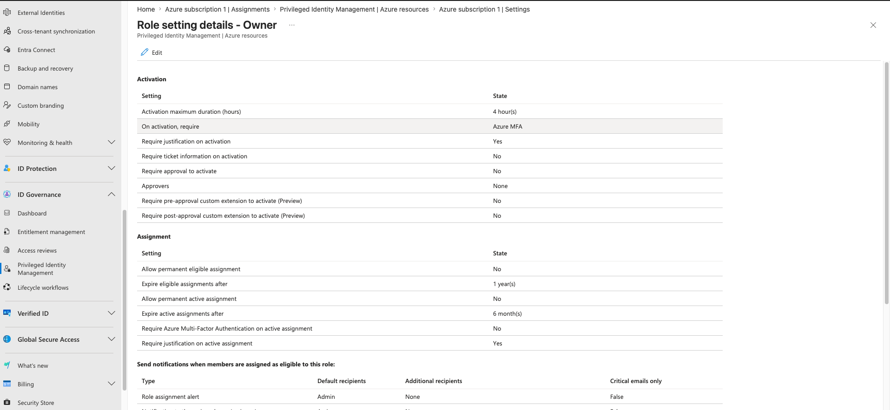

A notable difference from Entra role PIM appears here. Azure resource PIM enforces time-bound eligibility by default: "Allow permanent eligible assignment" is set to No, and eligibility expires after a maximum of one year. Entra role PIM, by contrast, permits permanent eligibility. The Azure default is arguably better hygiene, since it forces a periodic re-review of who is even eligible, not just who is active.

`adm-provost` was then added as an eligible Owner, taking the time-bound default (start July 2026, expiry July 2027).

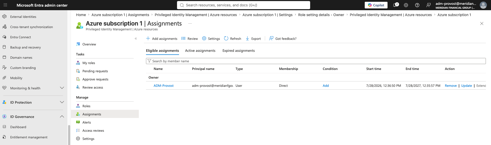

The standing Owner assignment was then removed. `adm-provost` retains User Access Administrator inherited from root, which preserves the ability to manage assignments and activate the eligible Owner when needed, so removing standing Owner did not create a lockout risk. The end state: no standing Owner anywhere on the subscription.

---

## Part C: Post-cutover alert review

PIM watches for risky patterns on its own: roles assigned outside PIM, too many Global Administrators, standing administrative access, unused privileged roles. Reviewing the alerts blade after a cutover confirms the remediation worked and demonstrates an operating rhythm rather than a one-time setup.

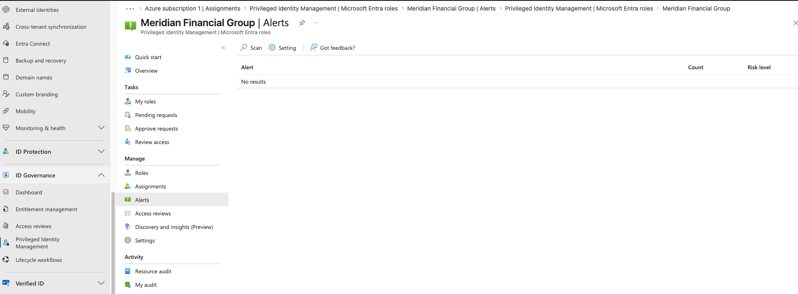

The board returned no findings. This is not an absence of evidence, it is the evidence. A clean alerts board after a privilege cutover confirms that standing access was eliminated and that no roles were assigned outside PIM. The session had just removed exactly the conditions the alerts look for (standing Global Admin, User Admin, and Owner, plus the dormant external Owner), so the clean result is the expected and desired outcome.

---

## Validation

| Check | Result | Where confirmed |
|---|---|---|
| User Admin tiered settings applied | Pass | User Administrator role settings (8h, no approval) |
| Patricia converted to eligible | Pass | Eligible assignments tab; standing removed cleanly |
| Security Admin settings configured, role empty | Pass | Security Administrator role settings |
| External account standing Owner removed | Pass | IAM Owner list shows only adm-provost |
| adm-provost Owner converted to eligible | Pass | Azure resources Eligible assignments |
| No standing Owner on subscription | Pass | Active assignments empty for Owner |
| Inherited UAA preserved (no lockout) | Pass | IAM shows adm-provost UAA from root intact |
| Post-cutover alerts clean | Pass | PIM Entra role Alerts, no results |

## Lessons Learned

**Break-glass is not always required to remove standing access.** Part 1 needed a break-glass account because an account cannot cleanly remove its own standing assignment. Converting a subordinate role on a different account (Patricia's User Admin, done by adm-provost) removed cleanly. The distinction is whether the removal is self-referential.

**The most dangerous standing privilege was on the resource plane, not the identity plane.** The identity-plane roles were expected targets. The genuine finding was a dormant, external, MFA-less account holding standing Owner over the whole subscription, surfaced only when the audit extended to Azure resource roles. This validates covering both planes rather than stopping at directory roles.

**Azure resource PIM is stricter than Entra role PIM by default.** Azure enforces time-bound eligibility (one-year maximum, no permanent eligibility), while Entra roles allow permanent eligibility. Worth knowing when reasoning about which plane needs tighter manual settings.

**A clean alert board is a result, not a non-event.** Framed correctly, "post-cutover alert review returned no findings" is a stronger statement than a board full of warnings. It confirms the remediation.

## Enterprise Best Practices

- Tier activation duration to blast radius; reserve approval for crown-jewel roles only.
- Pre-configure role settings even on empty roles, so JIT is ready before anyone needs it.
- Audit the Azure resource plane separately from directory roles; they are governed independently.
- Never remove the last Owner without a confirmed replacement path.
- Preserve an inherited management path (User Access Administrator) before removing standing Owner, to avoid lockout.
- Leave dormant identities in the directory for formal access review rather than deleting mid-cutover.

## Conclusion

Sprint 4 is complete. Privileged access across both the identity plane (Global Admin, User Admin, Security Admin) and the resource plane (subscription Owner) is now just-in-time, with standing access eliminated except for the by-design permanent break-glass accounts. The session's headline finding, a dormant external account owning the subscription, was remediated and its identity handed to Sprint 6 for formal review. Stale eligibility will be caught by the access reviews in that sprint.
