## Introduction

Sprint 1 established the identity foundation for Meridian Financial Group: a
dedicated Microsoft Entra tenant, a tiered administrative model, phishing-resistant
emergency access, naming standards, and the documentation infrastructure the rest
of the project builds on. The sprint's guiding constraint was to make the decisions
that are hardest to reverse later (tenant residency, initial domain, emergency
access design) deliberately and on the record.

## Business scenario

Meridian is standing up its Microsoft cloud identity plane. In a regulated financial
firm, auditors will later ask: *who could access what on day one, and how do you
know?* SOX ITGC reviews flag admin sprawl, missing emergency access, and personal
accounts holding Global Administrator. This sprint builds the audit trail from the
first click.

## Objectives

| # | Objective | Result |
|---|---|---|
| 1 | Provision a dedicated tenant | ✅ `meridianfgoutlook.onmicrosoft.com` |
| 2 | Tiered admin model: separate tenant owner from daily admin | ✅ adm-provost created; signup account demoted to zero roles |
| 3 | Two break-glass accounts with phishing-resistant MFA | ✅ Device-bound passkeys, tested end-to-end |
| 4 | Naming conventions | ✅ `/architecture/naming-conventions.md` |
| 5 | GitHub repository scaffold + project bible | ✅ 16-topic structure, living bible, screenshot index |
| 6 | Architecture decisions logged | ✅ AD-001 through AD-004 |

## Technologies used

Microsoft Entra ID (Free tier) · Microsoft Entra admin center · Microsoft Graph
PowerShell SDK (`Microsoft.Graph.Users`) · Temporary Access Pass · Passkeys (FIDO2,
device-bound, Microsoft Authenticator) · Security defaults · Git / GitHub ·
PowerShell 7 on macOS

## Architecture

**Tier 0 model at sprint close:**

```
┌─────────────────────────────────────────────────────────────┐
│ Meridian Financial Group tenant                             │
│ meridianfgoutlook.onmicrosoft.com                           │
│                                                             │
│  adm-provost ──────────── Global Administrator (working)    │
│  bg-emergency-01 ───────── GA, permanent, passkey ─┐        │
│  bg-emergency-02 ───────── GA, permanent, passkey ─┤        │
│                                    │               │        │
│                     sg-ca-exclude-breakglass ◄─────┘        │
│                     (2 members, 0 owners)                   │
│                                                             │
│  signup account ────────── NO directory roles               │
│                            (Azure billing only, vaulted)    │
│                                                             │
│  Security defaults: ENABLED (until CA replaces them, AD-004)│
└─────────────────────────────────────────────────────────────┘
```

### Architecture decisions

| AD | Decision | Rationale (summary) |
|---|---|---|
| AD-001 | Dedicated tenant via Azure free-account signup | Enterprises don't share identity planes across unrelated orgs. The original admin-center path was blocked: tenant creation now requires a **paid Entra P1/P2 license**. A paid Azure subscription is not sufficient, and trial licenses also fail the check. Final path: fresh signup; initial domain auto-generated (permanent, documented constraint). |
| AD-002 | Defer Entra ID P2 trial to Sprint 2 | Sprint 1 needs only the Free tier. The 30-day trial clock should cover dynamic groups, Conditional Access, and PIM, not repo scaffolding. |
| AD-003 | Break-glass with phishing-resistant MFA | Mandatory MFA enforcement makes password-only break-glass non-functional. Two cloud-only accounts, permanent GA, device-bound passkeys registered via TAP, a CA-exclusion group, and detection as the compensating control. |
| AD-004 | Security defaults stay ON until CA replaces them | Never create the unprotected window between "defaults off" and "CA enforced" that attackers exploit during migrations. |

## Implementation summary

### Phase 1: Tenant

1. New Azure free account with a fresh email auto-provisioned the tenant
   (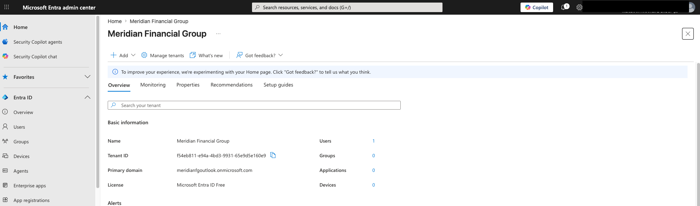)
2. Directory renamed to **Meridian Financial Group**; region US (permanent);
   security defaults confirmed enabled
   (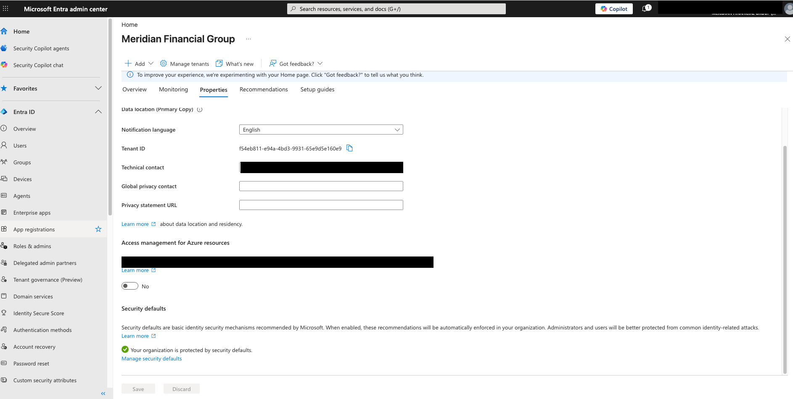)
3. Cloud-only Tier 0 daily admin `adm-provost` created and assigned Global
   Administrator; MFA registered; all further work performed as this account
   (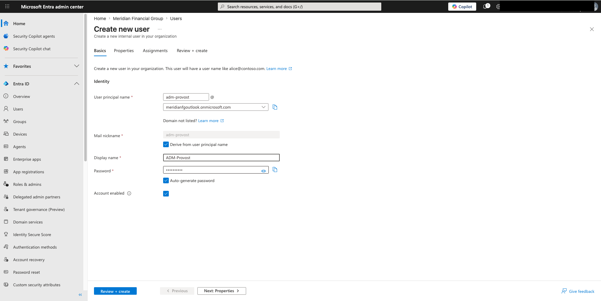)
   (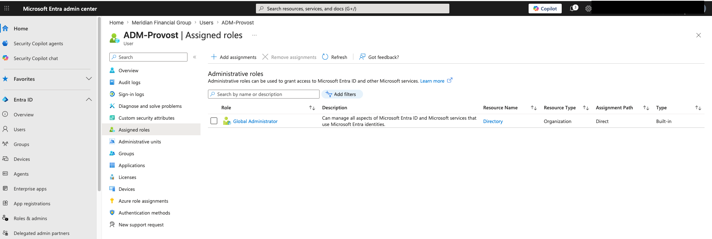)

### Phase 2: Repository

16-topic folder structure, README with sprint status table, project bible with the
AD register, and a screenshot index built at capture time (a hard lesson imported
from the predecessor SOC lab). Authentication to GitHub via PAT with `repo` scope,
stored in the macOS keychain.

### Phase 3: Break-glass build

1. **Authentication methods.** Passkey (FIDO2) and Temporary Access Pass verified
   enabled. New-tenant defaults are broader than older guidance assumes; reviewed
   and logged. (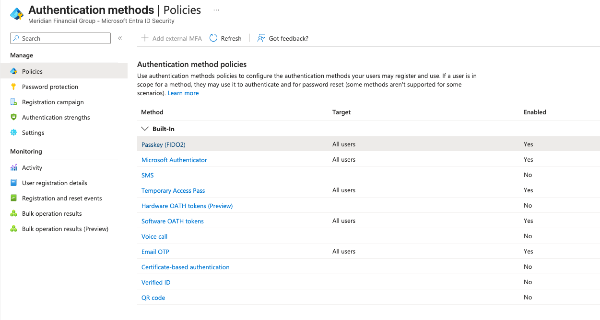)
2. **Accounts.** `bg-emergency-01/02` created with direct, permanent Global
   Administrator. (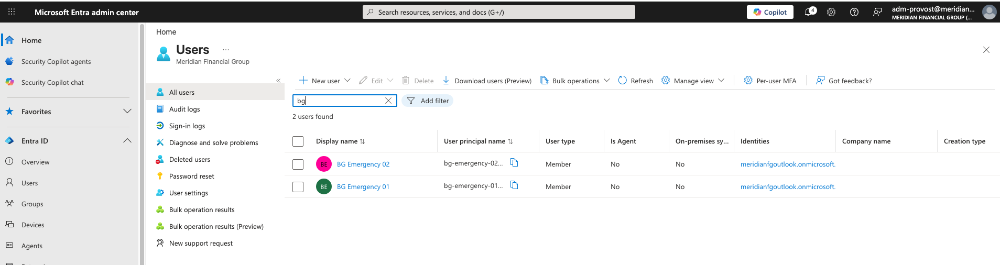)
   (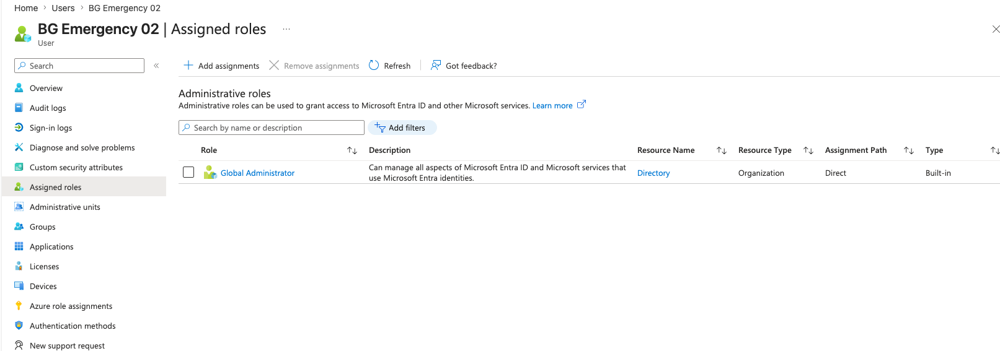)
3. **Password policy via Graph.** `DisablePasswordExpiration` set with
   `Update-MgUser` (no portal control exists for this property) and verified with
   `Get-MgUser`. Script: `/graph-scripts/set-breakglass-password-policy.ps1`.
   Scope used and justified: `User.ReadWrite.All`.
   (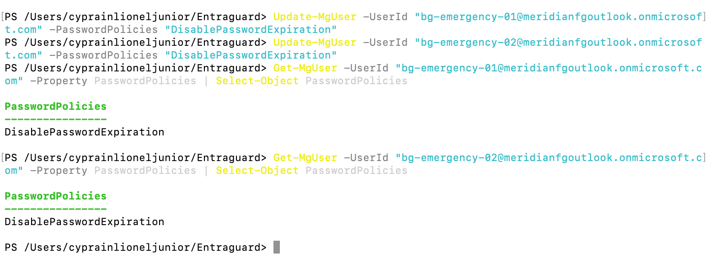
4. **Passkey registration.** TAP issued per account; sign-in at
   `aka.ms/mysecurityinfo`; security defaults forced standard MFA registration
   first (kept, documented); device-bound passkey added via the Authenticator QR
   flow. (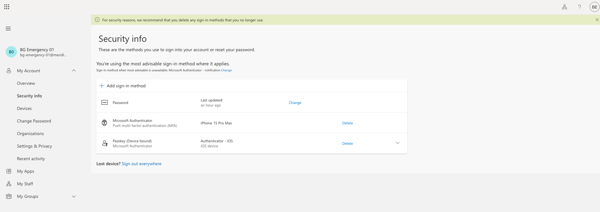
   (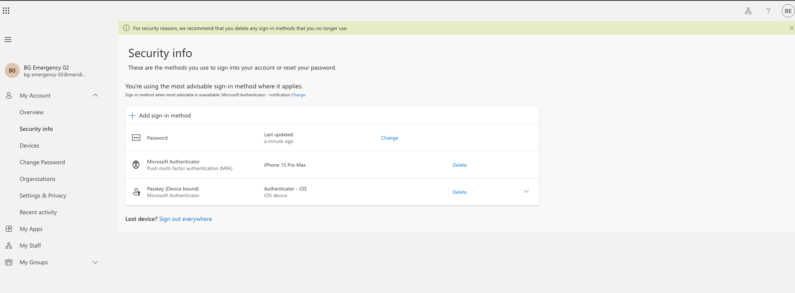)
5. **Live test.** Fresh-session portal sign-in with a passkey ceremony; the
   sign-in log shows `Passkey (device-bound)` · Succeeded · User approved.
   (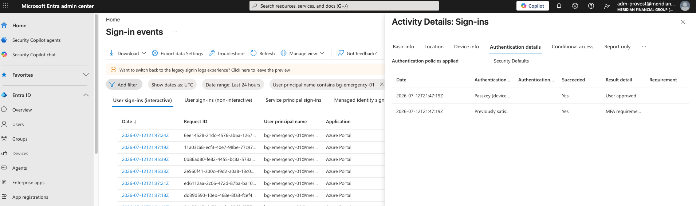
6. **Exclusion group.** `sg-ca-exclude-breakglass`, exactly two members, zero
   owners (ownership on a CA-exclusion group is a privilege-escalation path).
   (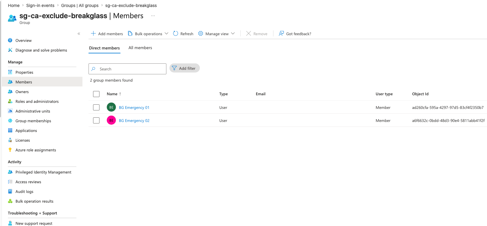
7. **Tenant owner demoted.** The signup account was stripped of Global
   Administrator once three tested doors existed.
   (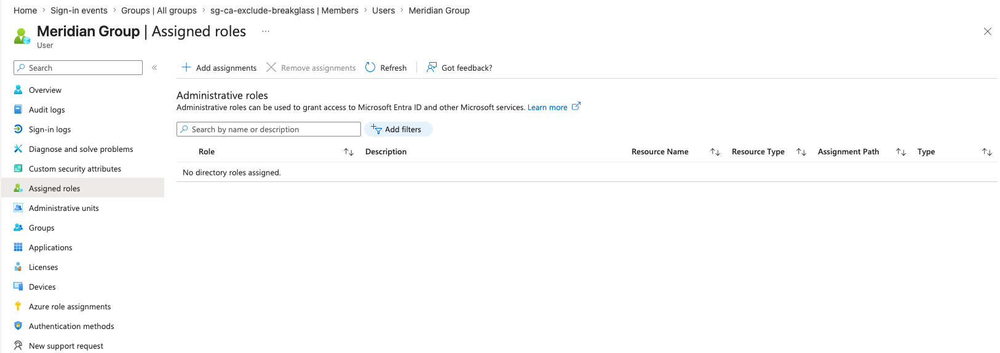

## Validation

| Check | Method | Result |
|---|---|---|
| Tenant provisioned, renamed, region US | Entra ID → Overview / Properties | ✅ |
| Security defaults enabled | Properties → Manage security defaults | ✅ |
| adm-provost GA + MFA | Assigned roles; Security info | ✅ |
| bg- accounts: permanent direct GA | Assigned roles (Direct, Built-in) | ✅ |
| Passwords never expire | `Get-MgUser -Property PasswordPolicies` | ✅ both |
| Passkeys registered (device-bound) | Security info per account | ✅ both |
| Passkey sign-in works to Azure Portal | Sign-in logs → Authentication details | ✅ |
| Exclusion group: 2 members, 0 owners | Group → Members / Owners | ✅ |
| Tenant owner: zero directory roles | Assigned roles → "No directory roles assigned" | ✅ |
| GA count minimal and explainable | 3 total, each justified | ✅ |

## Lessons learned

1. **Tenant creation is license-gated, not subscription-gated.** A paid Azure
   subscription does not permit tenant creation; a paid Entra P1/P2 license does.
   Even trial P1/P2 fails the check. Microsoft restricted this because mass tenant
   creation was abused as disposable attack infrastructure.
2. **Browser session state determines tenant targeting.** Signup flows attach
   subscriptions to whatever tenant the session belongs to. New tenants get
   provisioned from clean private sessions, always.
3. **Silence is success in Unix shells.** Verification (`ls`, `git status`,
   `Get-MgUser`) is how you convert silence into evidence.
4. **AuthN vs. authZ, live.** A GitHub token that authenticates but lacks the
   `repo` scope produces 403, not 401. And an exposed credential gets revoked and
   reissued, never reused.
5. **Pull before push.** Edits made in the GitHub web UI put the remote ahead of
   the local clone; every session starts with `git pull`.
6. **The portal exposes roughly 80% of the platform.** `PasswordPolicies` has no
   UI surface. Graph is the complete API; the portal is a curated subset.
7. **UI drifts from documentation.** New tenants ship with more auth methods
   enabled than older guidance assumes, and passkey settings moved into profiles.
   Verify paths at point of use.
8. **Session tokens hide ceremonies.** Proving a passkey sign-in required killing
   all browser state. "Previously satisfied" in the logs means a token, not a
   fresh authentication.

## Enterprise best practices demonstrated

- Emergency access designed for the failure modes it must survive: no CA, PIM, or
  federation dependency, and credentials stored outside the tenant they protect
- Phishing-resistant MFA on the highest-privilege accounts under mandatory MFA
- Minimal, inventoried Global Administrator population with per-account justification
- Detection as a compensating control where prevention is deliberately relaxed
- Least privilege applied to tooling itself (single Graph scope, logged with rationale)
- Honest lab-vs-production deltas documented rather than hidden

## Conclusion

Sprint 1 delivered a tenant whose day-one state is defensible to an auditor: every
privileged identity is justified, emergency access is tested and observable, and
every irreversible decision was made deliberately and logged. Sprint 2 (Identity
Lifecycle & Structure) begins with P2 trial activation (AD-002) and builds the
workforce: users, dynamic groups, and Administrative Units.

---

## Portfolio material

**Résumé bullet**

> Designed and implemented emergency-access architecture for a Microsoft Entra
> tenant under mandatory MFA: phishing-resistant FIDO2 passkey credentials
> bootstrapped via Temporary Access Pass, Conditional Access exclusion design,
> and detection-based compensating controls, validated end-to-end through
> sign-in log evidence.

**STAR story: "Design emergency access under mandatory MFA"**

- **Situation:** Standing up a new Entra tenant for a simulated financial firm
  after Microsoft began enforcing MFA on admin portals. The era of password-only
  break-glass accounts excluded from all policy was over.
- **Task:** Emergency access that survives CA misconfiguration, MFA service
  outage, and admin compromise, while itself satisfying MFA enforcement.
- **Action:** Two cloud-only accounts with permanent (non-PIM) Global Administrator;
  device-bound FIDO2 passkeys registered through Temporary Access Pass; passwords
  set never-to-expire via Graph (no portal control exists); a zero-owner CA
  exclusion group; credentials vaulted outside the tenant; a runbook with post-use
  rotation and quarterly testing; sign-in detection as the compensating control.
- **Result:** Verified passkey ceremony in sign-in logs ("Passkey (device-bound),
  user approved"), three explainable Global Admins, and the original signup
  identity holding zero directory roles.

**Interview questions this sprint prepares you for**

1. *How do you design break-glass accounts now that Microsoft enforces MFA on
   admin portals?* Phishing-resistant methods (passkey/FIDO2 or CBA) satisfy the
   enforcement; exclusion from CA remains, and protection shifts to the credential
   plus detection on any sign-in.
2. *Why permanent GA on break-glass instead of PIM-eligible?* PIM activation is
   itself a dependency that may be broken during the emergency; the exception is
   deliberate, minimal, and monitored.
3. *Where do break-glass credentials live, and why not Key Vault?* Outside the
   tenant they protect; a vault inside the tenant is a circular dependency during
   lockout.
4. *What's the difference between a device-bound and synced passkey, and when does
   it matter?* Synced passkeys replicate through consumer cloud keychains;
   stricter environments require device-bound so the credential cannot leave
   managed hardware.
5. *A valid credential returns 403 instead of 401. What does that tell you?*
   Authentication succeeded, authorization failed: identity is proven but lacks
   scope or permission. (Lived example: a GitHub PAT without the `repo` scope.)

**LinkedIn draft (optional post for the milestone)**

> Sprint 1 of EntraGuard is complete: a Microsoft Entra identity-security lab
> simulating a regulated financial firm. Highlight: building emergency access the
> 2026 way. Password-in-a-safe break-glass is dead under mandatory MFA. The modern
> pattern is Temporary Access Pass, then a device-bound FIDO2 passkey, then
> CA exclusion, with detection on every sign-in. Full write-up, scripts, and
> evidence in the repo. #MicrosoftEntra #IAM #CloudSecurity #ZeroTrust
