## Introduction

Sprint 2 populated Meridian with a realistic workforce and made the directory
organize itself: attribute-driven dynamic groups, a delegated administration
boundary proven by test, and licensing that follows group membership. The sprint
also started the Entra ID P2 trial clock, after a licensing detour that produced
some of the most instructive lessons in the project so far.

## Business scenario

Meridian has an identity plane but no people. This sprint builds the firm:
employees across front, middle, and back office, structured so that identity
management scales by rule instead of by hand. In a regulated financial firm,
delegation boundaries are a control, not a convenience: HR support must be able
to help HR staff without any technical possibility of touching a trader's account.

## Objectives and results

| # | Objective | Result |
|---|---|---|
| 1 | Activate Entra ID P2 trial (AD-002) | ✅ Active, expires 8/15/2026, 100 licenses |
| 2 | Define the org model | ✅ 25 users, 8 departments, attribute schema |
| 3 | Create the workforce | ✅ 1 portal + 24 via Graph bulk script |
| 4 | Dynamic groups per department | ✅ 8 groups, rule-driven, all validated |
| 5 | Administrative Units with scoped delegation | ✅ au-hr built and proven allow and deny |
| 6 | Group-based licensing | ✅ P2 inherited via all 8 dynamic groups, 26/100 assigned |

## Technologies used

Microsoft Entra ID P2 (trial) · Microsoft Graph PowerShell SDK
(`Microsoft.Graph.Users`, groups via `New-MgGroup`) · Dynamic membership rules ·
Administrative Units · Group-based licensing · Temporary Access Pass ·
CSV-driven bulk provisioning · PowerShell 7 on macOS

## Architecture

**The org model drives everything downstream:**

| Department | Users | Downstream consumer |
|---|---|---|
| Executive | 2 | High-value CA personas (Sprint 3) |
| Trading | 4 | SoD conflicts vs Finance (Sprint 6/9) |
| Advisory | 3 | Chicago Office location scenarios |
| Risk and Compliance | 3 | Access review reviewers (Sprint 6) |
| Finance | 3 | SOX-relevant vs Trading |
| IT | 4 | Future scoped admins |
| HR | 3 | au-hr delegation boundary, joiner/mover/leaver (Sprint 6) |
| Legal | 3 | Data-sensitive persona |

**Attribute schema (the automation contract):** Department drives dynamic groups,
Job Title feeds CA personas, Employee Type separates staff from contractors,
Usage Location gates licensing, Office Location enables location scenarios.
Employee hire date and Employee ID are deferred to Sprint 6 (Lifecycle Workflows
prerequisites, logged in the bible).

**Architecture decision logged this sprint:**

| AD | Decision | Rationale |
|---|---|---|
| AD-005 | Licenses assigned via dynamic groups, not per user | One attribute change (department) drives group membership, licensing, and future CA coverage. Admins stay direct-assigned so a workforce attribute typo can never delicense an administrator. |

## Implementation summary

### Phase 1: P2 trial activation (the licensing detour)

The first activation attempt threw "subscription limit reached for this offer."
Diagnosis revealed a chain of real-world lessons:

1. The P2 trial offer had already been consumed, in the wrong tenant: a session
   signed into the SOC lab tenant had activated it there on 7/2. Every checkout
   binds to the session's tenant.
2. The stray trial was defused (license unassigned, recurring billing off).
3. The Meridian retry then failed differently: adm-provost, despite Global
   Administrator, had no standing on the MCA billing account. Billing roles are
   managed in Azure portal Cost Management + Billing IAM, not the M365 admin
   center, and directory roles confer no billing rights.
4. After granting the billing role, checkout succeeded once the Sold-to profile
   was completed ("Try now" stays disabled until it is).

Result: P2 active in Meridian, 100 licenses, expiry 8/15/2026, day-25 checkpoint
8/9 logged in the bible.
(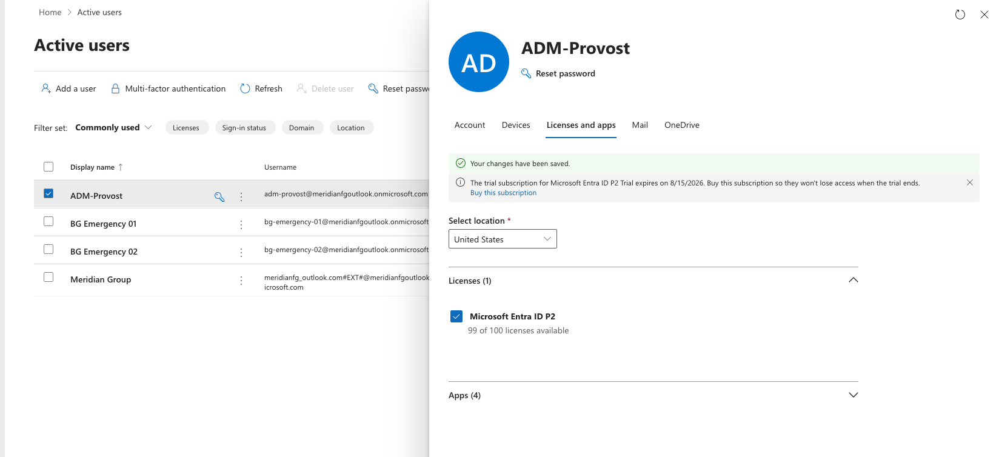)

### Phase 2: Workforce creation, portal first then automation

The first user (Sarah Mitchell, Head of Trading) was created in the portal with
the full attribute set, to establish what the automation must reproduce.
(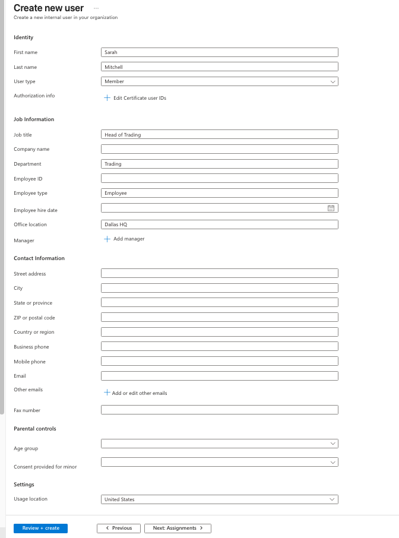)

The remaining 24 came from a CSV roster processed by a Graph PowerShell script:
per-user random passwords (never recorded; admins reset if ever needed), try/catch
per row so one failure cannot abort the run, and a department summary as built-in
verification. Kevin O'Brien became Kevin OBrien deliberately: apostrophes in UPNs
invite downstream failures.
(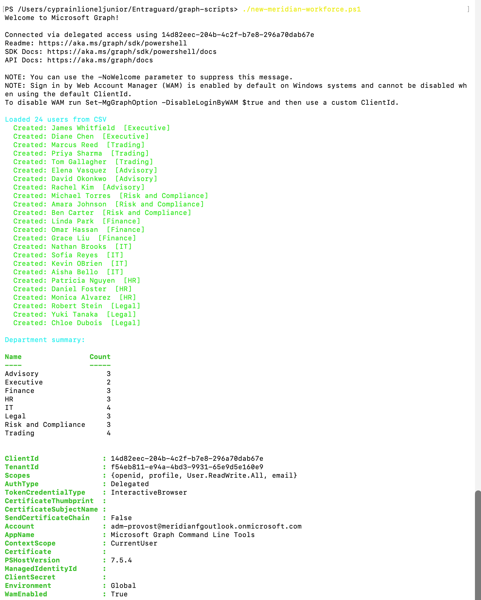)
(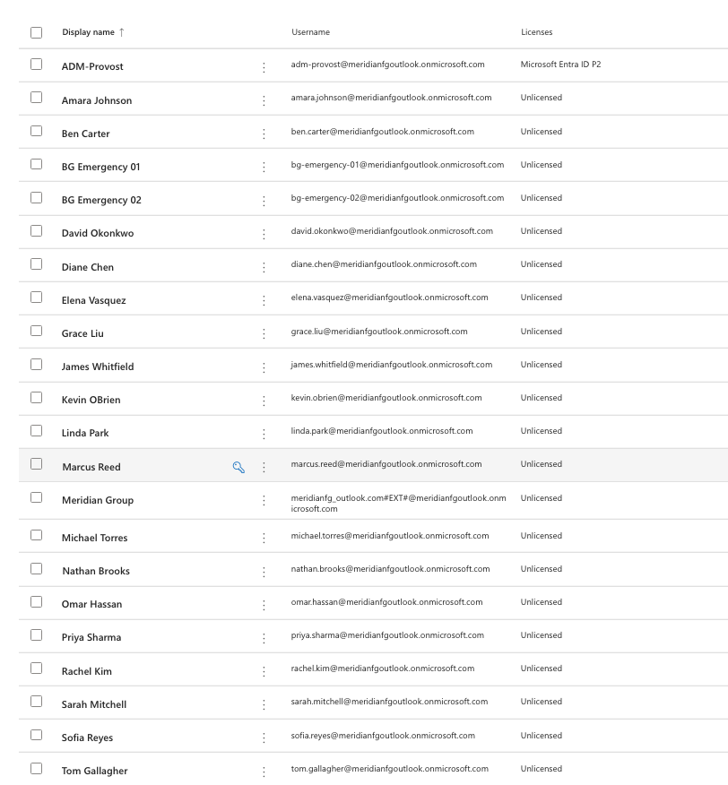)

Scripts: `/graph-scripts/new-meridian-workforce.ps1`, roster
`/graph-scripts/meridian-workforce.csv`.

### Phase 3: Dynamic groups

`sg-dyn-trading` was built in the portal rule builder to learn the syntax
(`user.department -eq "Trading"`), then the remaining seven were scripted with
`New-MgGroup -GroupTypes DynamicMembership`.
(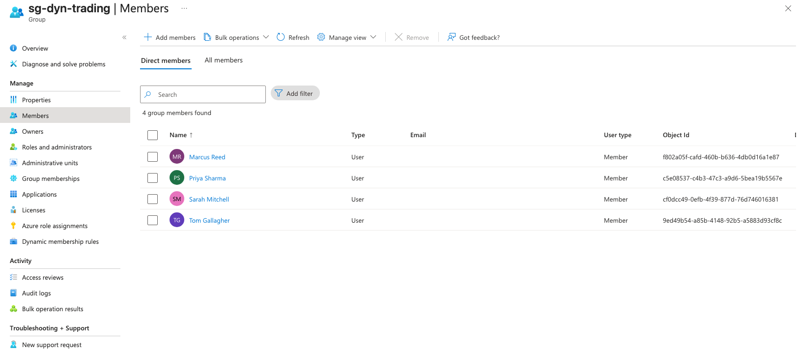)
(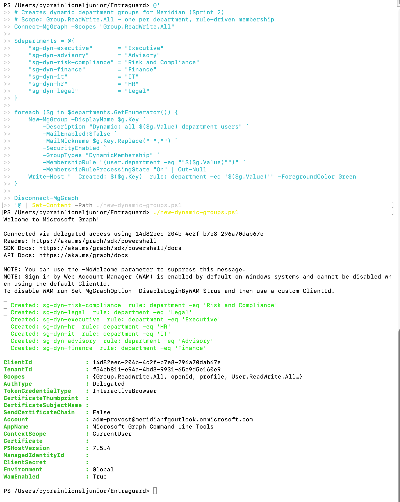)
(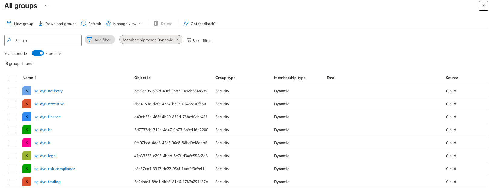)

**The silent-zero incident:** two groups (legal, risk-compliance) showed zero
members after evaluation. Diagnosis compared the stored rule against the stored
user attributes: both matched exactly and ProcessingState was On, so the verdict
was evaluation lag, later confirmed when both populated. Dynamic groups fail
silently by design: zero members is not an error state, so the diagnostic
discipline (rule vs attribute, then trust ProcessingState) is the takeaway.
(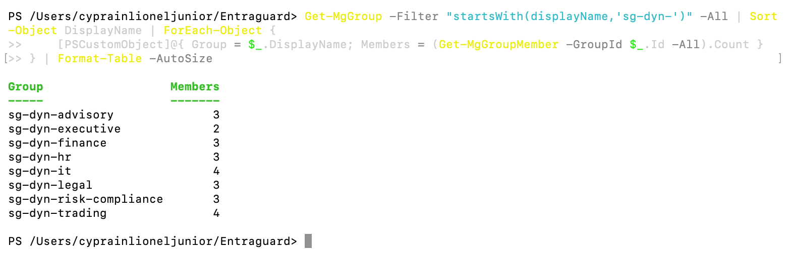)

### Phase 4: Administrative Units and proven delegation

`au-hr` was created with the three HR users as members.
(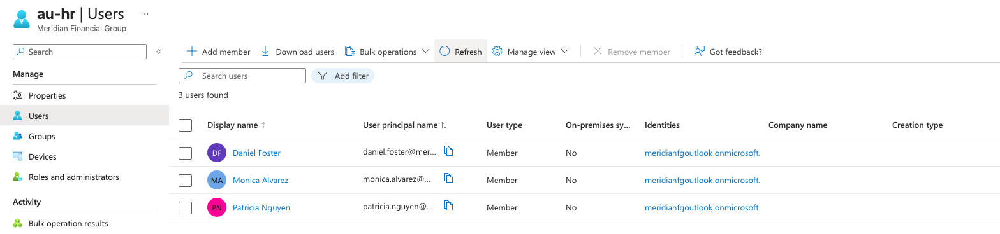)

**A real wrong-scope correction:** the first User Administrator assignment to
Patricia Nguyen was made from her profile blade, which always assigns at
directory scope. Her Assigned roles view exposed it (Resource Name: Directory),
the assignment was removed, and the role was reassigned from inside the AU's own
Roles and administrators blade. Where you start the assignment determines its
scope, and the Resource Name column is how you audit which one someone holds.
(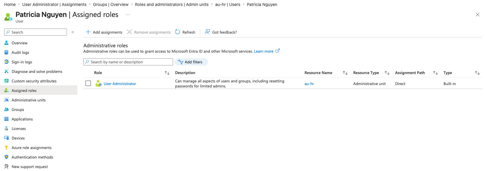)

**The delegation test:** Patricia signed in via Temporary Access Pass, registered
MFA (security defaults), then:

- Reset Monica Alvarez's password inside au-hr: **succeeded**
  (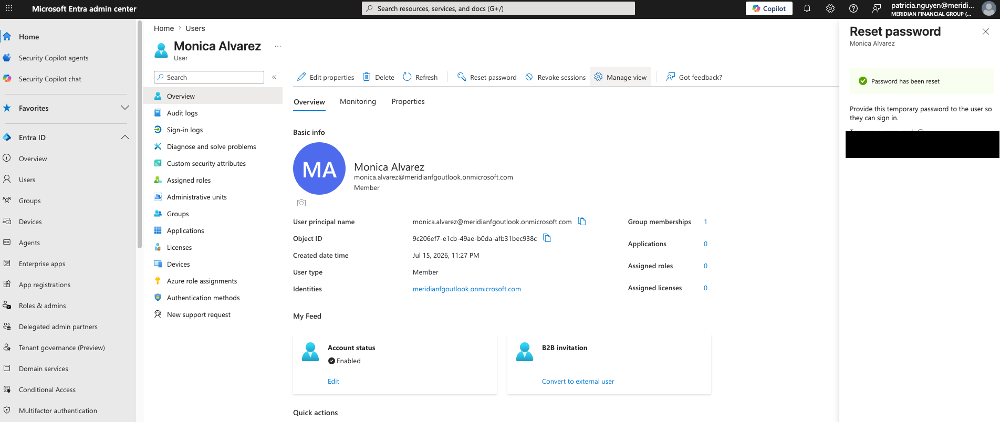)
- Attempted the same on Sarah Mitchell outside the AU: **denied** with
  "incorrect level of administrative privilege"
  (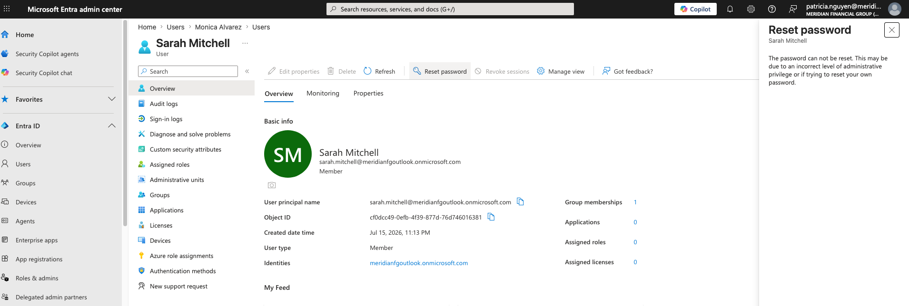)

The audit log captured three correlated entries for the allowed action (the
directory operation, the password service completion, and an automatic
StsRefreshToken update that invalidated Monica's existing sessions), all
attributed to Patricia. The denied action produced no entry because it never
executed: the absence is the control working.
(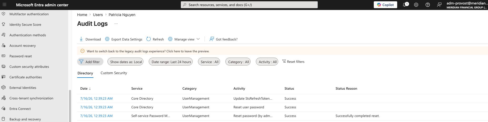)

### Phase 5: Group-based licensing

P2 was attached to all eight dynamic groups. Membership now drives licensing:
26 of 100 assigned (25 inherited + adm-provost direct), zero errors. The known
failure mode (missing usage location blocks inheritance silently) was pre-solved
by including UsageLocation in the CSV schema from the start.
(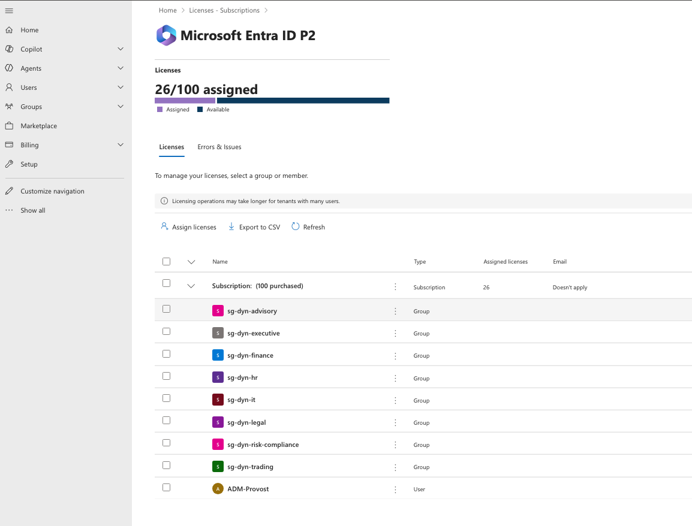)

## Validation

| Check | Method | Result |
|---|---|---|
| P2 active, expiry logged | Billing → Your products; Overview license field | ✅ 8/15/2026 |
| 25 workforce users with full attributes | Bulk script summary; Users blade | ✅ |
| 8 dynamic groups, correct rules | Get-MgGroup rule inspection | ✅ |
| Membership counts correct | Scripted count table: 2+3+3+3+4+3+3+4 = 25 | ✅ |
| au-hr contains exactly the 3 HR users | AU Users blade | ✅ |
| Patricia's role scoped to au-hr | Assigned roles, Resource Name = au-hr | ✅ |
| Delegation allow inside AU | Password reset on Monica succeeded | ✅ |
| Delegation deny outside AU | Password reset on Sarah denied | ✅ |
| Audit trail attributable | Audit logs, initiator patricia.nguyen | ✅ |
| Group-based licensing, no errors | 26/100 assigned; Errors & Issues empty | ✅ |

## Lessons learned

1. **Every checkout binds to the session's tenant.** The "subscription limit"
   error was the P2 trial already consumed in the SOC lab tenant by a stray
   session. Verify the tenant badge before any transaction.
2. **Three permission planes, confirmed empirically.** Directory roles (GA),
   billing roles (MCA IAM in the Azure portal), and Azure RBAC (subscription IAM)
   are separate systems; holding one grants nothing in the others.
3. **Dynamic rules are exact string matches.** "Risk and Compliance" not
   "Risk & Compliance"; the rule must match the stored attribute, not the org
   chart's spelling.
4. **Zero members is not an error.** Dynamic groups fail silently; diagnose by
   comparing stored rule to stored attribute, then trust ProcessingState and
   evaluation lag before assuming breakage.
5. **Assignment origin determines scope.** A user's Assigned roles blade assigns
   tenant-wide; only the AU's Roles and administrators blade assigns AU-scoped.
   The Resource Name column is the audit.
6. **License entitlements propagate asynchronously.** Feature blades can show
   stale license claims (including upsell panes in a licensed tenant); a fresh
   session re-evaluates.
7. **Usage location gates group licensing silently.** Designed into the CSV
   schema up front instead of discovered in the Errors tab.
8. **Connect, do, disconnect.** "Authentication needed" mid-session is not an
   error to debug; Graph sessions expire and reconnecting is the fix.

## Enterprise best practices demonstrated

- Portal first, then automation: every scripted pattern was performed manually
  once before being encoded
- Attribute quality treated as the automation contract, with deferred fields
  (hire date, employee ID) logged as Sprint 6 prerequisites
- Delegation proven by positive and negative test, with audit evidence, not
  just configured
- Licensing follows structure (groups), with admins deliberately excepted
- Failures documented as first-class material: wrong-tenant trial, wrong-scope
  assignment, silent-zero groups

## Conclusion

Meridian now has a workforce that manages itself: one attribute change moves a
user between departments, groups, and licenses with no admin clicks, and HR
support can help HR staff while being technically incapable of touching a
trader. Sprint 3 (Authentication & Access Foundations) builds the Conditional
Access persona architecture on top of these groups, starting in report-only
mode, and carries the first hard deadline: the P2 trial expires 8/15.

---

## Portfolio material

**Résumé bullet**

> Designed and automated identity lifecycle for a simulated financial firm in
> Microsoft Entra ID: CSV-driven bulk provisioning via Graph PowerShell,
> attribute-driven dynamic groups, group-based licensing, and Administrative
> Unit delegation validated by positive and negative testing with audit log
> evidence.

**STAR story: "Prove a delegation boundary actually works"**

- **Situation:** A simulated regulated financial firm needed HR support staff
  able to manage HR accounts without any technical ability to touch front
  office users.
- **Task:** Build the boundary and prove it, with evidence an auditor would
  accept.
- **Action:** Created an Administrative Unit containing the HR department,
  assigned User Administrator scoped to the AU (after catching and correcting
  an accidental directory-scoped assignment via the Resource Name column),
  then tested as the delegated admin: password reset inside the AU and the
  same action outside it.
- **Result:** Allow and deny both proven and screenshotted; audit logs showed
  three correlated, attributable entries for the allowed action and none for
  the denied one. The wrong-scope correction became documentation of exactly
  the audit skill the control exists to satisfy.

**Interview questions this sprint prepares me for**

1. *How do dynamic groups fail, and how do you debug them?* Silently: zero
   members with no error. Compare the stored rule string to the stored user
   attribute, check ProcessingState, then allow for evaluation lag.
2. *What is the difference between assigning a role from a user's profile and
   from an Administrative Unit?* Origin determines scope: profile assigns
   directory-wide, the AU blade assigns AU-scoped. Same role name, different
   blast radius, auditable via Resource Name.
3. *Why assign licenses to groups instead of users?* Membership-driven
   assignment scales and self-corrects, and pairs with dynamic groups so one
   HR attribute drives the whole chain. Exception: admins stay direct-assigned
   so attribute errors cannot delicense them.
4. *A user in a licensed group has no license. First check?* Usage location:
   group-based licensing fails silently without it (then the product's Errors
   & Issues tab).
5. *GA cannot see subscription credits or buy licenses. Why?* Three separate
   permission planes: directory roles, billing account roles, and Azure RBAC.
   GA holds only the first by default.

**LinkedIn draft (optional)**

> Sprint 2 of EntraGuard: 25 users provisioned by Graph PowerShell from a CSV
> roster, eight dynamic groups assembling themselves from one attribute, and an
> Administrative Unit delegation boundary proven both ways: the HR admin reset
> an HR password, then got denied on a trader. The deny screenshot is the whole
> point. Repo in comments. #MicrosoftEntra #IAM #IdentityGovernance
